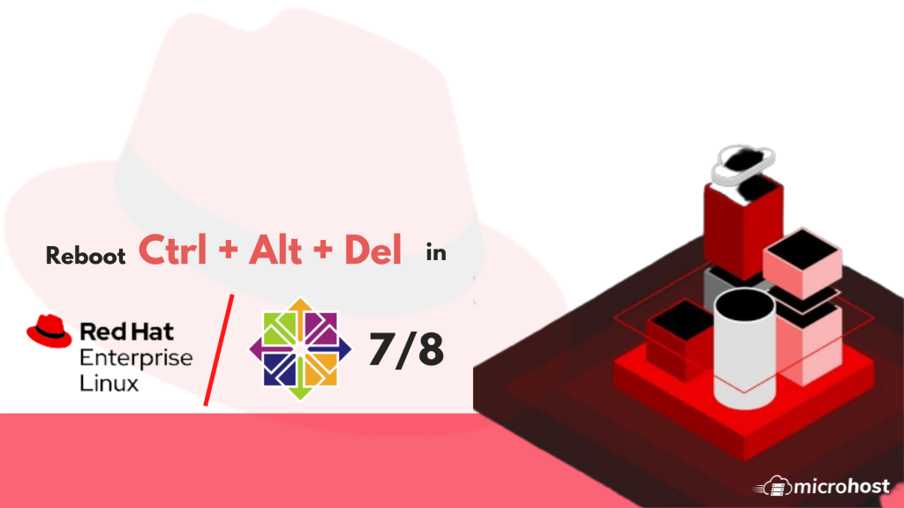
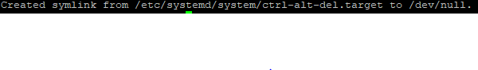
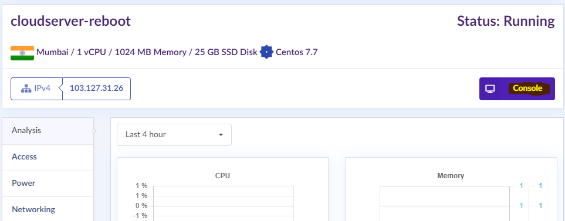

:: In this blog we will know the process to disable the Ctrl-Alt-Del Key feature in the RHEL/CentOS system. This trick will work with both VPS & Physical Machine as well.

:: Firstly, you need to login on your Microhost Cloud Server with your root login details.


:: Then you need to execute the below command on system with root privilege to run.

```
 # systemctl mask ctrl-alt-del.target 
```

:: After successful execute this command, it’s shown below result



:: Now you Need to login into Microhost Cloud Platform then click on Console screen to access the KVM to check whether the Ctrl-Alt-Del Key is working or not.



:: I have Press the Ctrl-Alt-Del Key in the right hand corner but system is not rebooting, it means that this method is working to stop this action.


Thank You!
