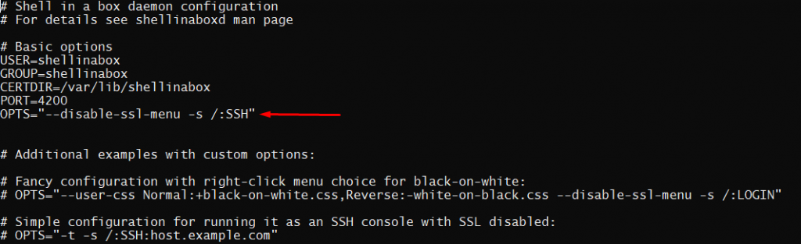
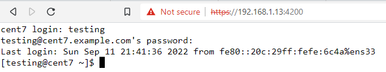

<figure>


<figcaption>

How to access CentOS terminal by browser: Shellinabox

</figcaption>

</figure>

Before learning how to access CentOS terminal by browser: Shellinabox. Markus Gutschke made Shell In A Box, which you say as "shellinabox." It is a web-based terminal emulator. It has a built-in web server that runs as a web-based SSH client on a specified port and gives you a web terminal emulator to access and control your Linux Server SSH Shell remotely using any AJAX/JavaScript and CSS enabled browsers without the need for additional browser plugins like FireSSH.

In this tutorial, we will see how to install Shellinabox and use a modern web browser on any machine to connect to a remote SSH terminal. When you are behind a firewall and only HTTP(s) traffic can get through, Web-based SSH is very helpful.

## Overview:

Shellinabox is included by default on many Linux distributions, such as Debian, Ubuntu, and Linux Mint, through their default repositories. But in CentOS we need to install extra repository for enterprises Linux.

## Prerequisites:

- Super user( root) or any normal user with SUDO privileges.
- Yum or package repositories enabled and available to install packages.

## 1- Installation

Step 1: To install the Shellinabox on your CentOS server, first install the epel-repolistory on it. To do so, use the below command.  
```
# yum install epel-release -y 
```

And now you can install the shellinabox on your machine.

```
# yum install shellinabox -y  
```
# systemctl start shellinaboxd  

```
```
# systemctl enable shellinaboxd
```

```

## Configure Shellinabox

Step 2: The configuration file has a different name and directory in which it is present. /etc/sysconfig/shellinaboxd

```
# vi /etc/sysconfig/shellinaboxd 
```

<figure>



<figcaption>

content of /etc/sysconfig/shellinaboxd

</figcaption>

</figure>

Make sure to have the SSH option in the OPTS entry in the configuration file.

## Points to remember:

- For security reasons, we should change the default port number of shellinabox service.
- Make sure to enable the shellinabox port in your firewall( if you are using one)

## Verify the port and running status of Shellinabox

```
# netstat -tunlp | grep shellinaboxd 
```

```

tcp    0     0 0.0.0.0:4200     0.0.0.0:*         LISTEN  1908/shellinaboxd
```

Now, open your web browser and go to https://Your-IP-Address:4200. You should be able to see an SSH terminal that runs on the web. When you log in with your username and password, you should see your shell prompt.

<figure>


<figcaption>

Browser's first page

</figcaption>

</figure>

Step 3: Now, when you do just as mentioned in above step, you will be asked to go advanced and proceed to your serverip. After proceeding further, you will see a blank screen asking for the login password.

Enter here, your login username and password to continue using your terminal in browser.

<figure>



<figcaption>

Shellinabox terminal logged in

</figcaption>

</figure>

Here you go, accessing your terminal of centos machine using shellinaboxd utility

In this tutorial, you have learned- How to access CentOS terminal by browser: Shellinabox

Also read: [How to install Composer on Ubuntu 20.04](https://utho.com/docs/tutorial/how-to-install-composer-on-ubuntu-20-04/), [How to install Drupal on CentOS server](https://utho.com/docs/tutorial/how-to-install-drupal-on-centos-server/)
