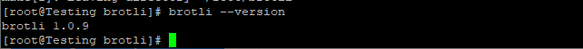

## Introduction

In this article, you will learn how to build Brotli from source on CentOS 7.

[Brotli](https://en.wikipedia.org/wiki/Brotli), a compression algorithm, claims to be more effective at compressing web pages than its predecessor, GZIP, and to have shorter compression times. It is available at no cost, has widespread support across current web servers, and can be used by anyone.Brotli is a compression format that is widely supported by today's web servers.

A pre-defined dictionary of frequently used words is one of the characteristics that helps Brotli improve its compression efficiency. Because the server and the client both have access to this dictionary, we can save some space.

Brotli and GZIP, two compression formats, both help reduce page size by compressing files. Faster page loads are the result of less files.

## Before getting started

Be sure to check the [CentOS](https://utho.com/docs/tutorial/how-to-install-git-on-centos-7/) version.

```
# cat /etc/centos-release
```

Make a new user that is not root that can use sudo and log in as that user.

```
# useradd -c "micro host" microhost && passwd microhost
```

```
# usermod -aG wheel microhost
```

```
# su - microhost
```

To log in, please change microhost to your username.

## Create a new time zone

```
# timedatectl list-timezones
```

```
# sudo timedatectl set-timezone 'Region/City'
```

Please update your system to the most recent version.

```
# sudo yum update -y
```

## Create Brotli

Get the necessary software and build tools installed.

```
# sudo yum install -y gcc make bc sed autoconf automake libtool git
```

Get a copy of the Brotli repository.

```
# git clone https://github.com/google/brotli.git
```

Access the Brotli code repository.

```
# cd brotli
```

You should make a reference page for using Brotli commands.

\[consoel\]# sudo cp ~/brotli/docs/brotli.1 /usr/share/man/man1 && sudo gzip /usr/share/man/man1/brotli.1\[/console\]

Look in the user guide.

```
# man brotli
```

Execute the ./bootstrap command to create the Autotools configure file.

```
# ./bootstrap
```

Once you've run the preceding command, you'll have access to the standard C programme construction stages, including configure, make, and make install.

Use the ./configure --help command for further information.

Now, make Brotli.

```
# ./configure --prefix=/usr --bindir=/usr/bin --sbindir=/usr/sbin --libexecdir=/usr/lib64/brotli --libdir=/usr/lib64/brotli --datarootdir=/usr/share --mandir=/usr/share/man/man1 --docdir=/usr/share/doc
```

```
# make
```

```
# sudo make install
```

A successful build allows you to verify the version.

```
# brotli --version
```



Hopefully, you have learned how to build Brotli from source on CentOS 7.

Thank You 🙂
