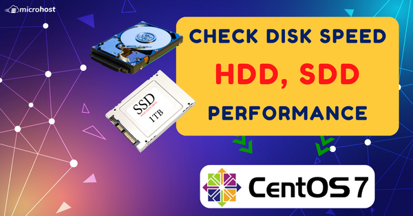
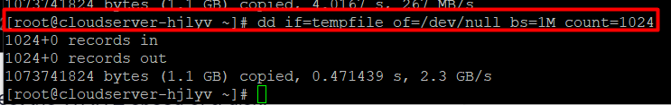

Step 1. Login into the server using root credentials on putty. 


Step 2 : Run the following command to test the WRITE speed of a disk.

```
# sync; dd if=/dev/zero of=tempfile bs=1M count=1024; sync
```

Step 3 : Run the following command to test the READ speed of a disk.

```
 dd if=tempfile of=/dev/null bs=1M count=1024 
```



Thank you!!
