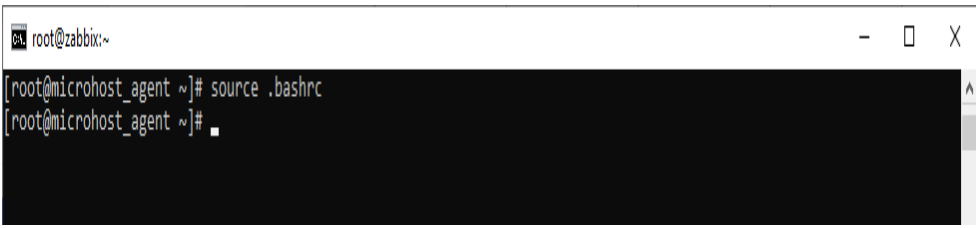

New Linux or Unix users often ask this. "Command not found" means Linux or UNIX looked everywhere for that application but couldn't find it. You may have misspelled the command name (typo) or the system administrator did not install it. Try these recommendations to fix this error:

Ensure that command is the path  
PATH is a shell environment variable that specifies the folders that your shell will examine to locate commands. The current search path can be viewed with the following echo/printf command:

**Step 1.** Log in to your server via SSH.

  
**step :2**  
```
#echo "$PATH"
```


Most user commands are in the directories /bin, /usr/bin, or /usr/local/bin. These directories are where all of your programmes are put. When you type "clear," you run the /usr/bin/clear file. So, if it isn't in your PATH, try adding directories to your search path as follows (setup Linux or UNIX search path with the following bash export command):

**Step:3**  
```
#export PATH=$PATH:/bin:/usr/local/bin
```


copy this command(export PATH=$PATH:/bin:/usr/local/bin) to .bashrc file  
**Step:4**  
```
#vi .bashrc
```


bashrc file is a script, and by source it, the commands contained within it are executed.

**Step:5**  
```
#source .bashrc
```

Why source bashrc

Running the bashrc file is one reason to use source. bashrc is a script file executed when launching an interactive shell. It's per-user and in your home directory.  

