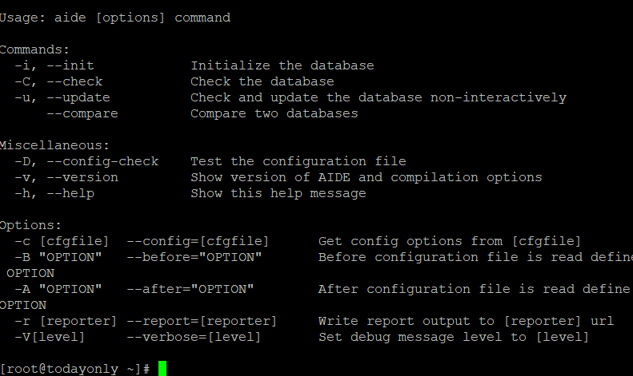
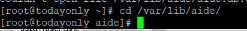

**Description**

AIDE, or Advanced Intrusion Detection Environment, is a free and open source software that maintains a database of files on the system and then utilises that database to ensure file integrity and identify system intrusions. To ensure the file's integrity, it employs numerous message digest techniques. All of the standard file properties can also be tested for consistency. More on the [RHEL](https://www.redhat.com/en/technologies/linux-platforms/enterprise-linux) Security Guide

## Qualities of AIDE

- It supports md5, sha1, rmd160, tiger, crc32, sha256, sha512, and whirlpool message digest algorithms, as well as libmhash: gost, haval, and crc32b.
- File attributes supported include file type, permissions, inode, uid, gid, link name, size, block count, number of links, mtime, ctime, and atime.
- Posix ACL, SELinux, XAttrs, and extended file system attributes are also supported.
- It allows you to select which files and directories to monitor and which to ignore using strong regular expressions.
- If zlib support is compiled in, it also supports gzip database compression.
- It includes static binary support for standalone client-server monitoring settings. aide.github.io has further information.  
    

## How Does AIDE Work?

During initialization, AIDE creates a database of all files based on the rules given in the /etc/aide.conf configuration file. Following database initialization, we may run file integrity checks and system intrusion detection on those files. If you want to add more files and directories, you must alter the configuration in the /etc/aide.conf file and then execute checks against those files and directories.

## Install and use AIDE on RHEL/CentOS 7/8.

Before installing a new package, use the yum update command to refresh the package cache with all the newest releases from the repository, as shown below. If you need to upgrade a package, use the yum upgrade command.

```
yum update
```
## Install AIDE

```
yum install aide
```


##  Check Version

After a successful installation, you can check the utility version with the assistance —version command, as shown below.

```
aide --version
```


## Create the First Database

Before completing integrity and intrusion tests, you must initialise the database based on the /etc/aide.conf configuration using the aide —init command, as seen below. If you wish to add additional files and directories to the database, you must modify the /etc/aide.conf configuration file.

```
aide --init
```


## Conduct integrity checks.

You can run the checks manually or using a cron job. To conduct manual checks, use the aide —check command as shown below, however if you want to perform checks on a daily, weekly, or monthly basis, it is always a good idea to set up a cron job for that.

```
aide --check
```
## AIDE Database should be updated.

If you choose, you can also use the aide —update command to update the AIDE database, as seen below.

```
aide --update
```
## Examine Every Available Option

```
aide --help
```


## Troubleshooting

When doing integrity checks using the aide —check command, you may receive a "Couldn't open file /var/lib/aide/aide.db.gz for reading error."


If you receive the above error, just navigate to the /var/lib/aide directory and use the ln -s aide.db.new.gz aide.db.gz command to make a soft link of aide.db.gz.

```
cd /var/lib/aide/
```


```
ln -s aide.db.new.gz aide.db.gz
```
You should now be able to complete the integrity tests if you try again.

Must Read : [How to Install and Use Apache Cassandra on Ubuntu 20.04 LTS](https://utho.com/docs/tutorial/how-to-install-and-use-apache-cassandra-on-ubuntu-20-04-lts/)

**Thankyou**
