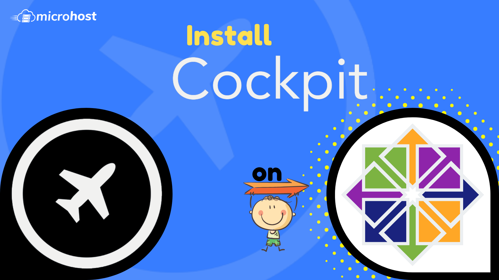
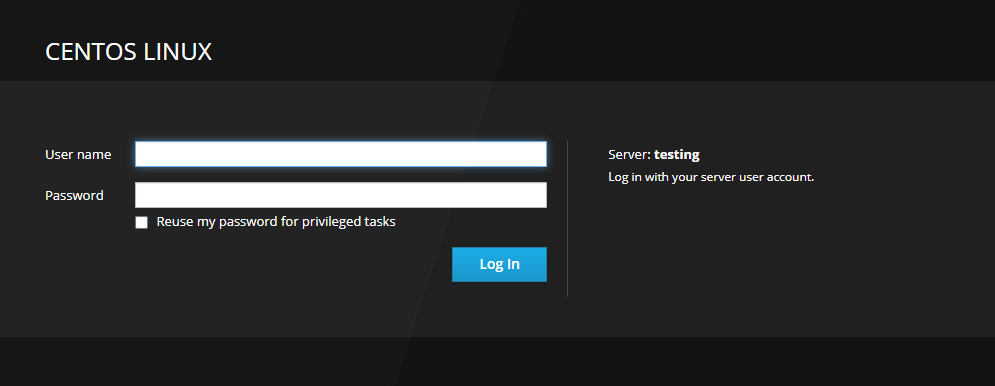

The Cockpit is a web console with an easy-to-use web-based interface that lets you manage your servers' settings. Because it is also a web console, you can also use it on your phone or tablet.

You can do a wide range of administrative tasks through the Cockpit web console, such as:

- Taking care of service
- Taking care of accounts
- System service management and monitoring
- Setting up network connections and a firewall
- Reviewing system logs
- Managing virtual machines
- Making reports on diagnoses
- Setting kernel dump configuration
- Setting up SELinux
- Changing the software
- Taking care of subscriptions to systems

The Cockpit web console uses the same system APIs as the terminal, and tasks done in the terminal are quickly reflected in the web console. You can also change the settings directly through the web console or the terminal.

## Installing Cockpit Web Console in CentOS 7.7

You can install it on your system by using the command below, which will install the cockpit with its required dependencies.

```
yum install cockpit -y
```
<figure>


<figcaption>

confirmation of installation

</figcaption>

</figure>

Next, enable and start the `cockpit.socket` service to connect to the system through the web console and verify the service and running the cockpit process

```
systemctl start cockpit 
systemctl enable cockpit
```
 If you are running a [firewalld](https://utho.com/docs/tutorial/firewalld-with-centos-7/) on the system, you need to open the cockpit port **9090** in the firewall.

```
firewall-cmd --permanent --add-service=cockpit 
firewall-cmd --reload
```
## Logging in to the Cockpit Web Console in CentOS 8

The steps below show how to use a local system user account to log in to the Cockpit web console for the first time. As Cockpit uses a certain PAM stack authentication found at /etc/pam.d/cockpit, you can log in with the user name and password of any local account on the system

Go to the following URLs in your web browser to open the Cockpit web console:

<figure>


<figcaption>

Warning page

</figcaption>

</figure>

After clicking 'proceed to ...(unsafe)' you will see a similar page like below.

<figure>



<figcaption>

Login page of cockpit

</figcaption>

</figure>
