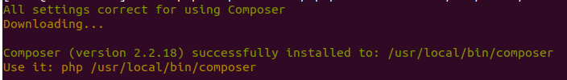

<figure>


<figcaption>

How to install Composer on CentOS server

</figcaption>

</figure>

In this tutorial we will learn how to install Composer on Centos 7 or on a more recent version. [Composer](http://getcomposer.org/) is a tool for taking care of PHP dependencies. It lets you list the libraries that your project needs, and it will install, update, and manage them for you.

Composer is not like Yum or Apt in that it is not a package manager. Yes, it works with "packages" or libraries, but it handles them per project and installs them in a directory (like "vendor") inside your project. It doesn't install anything everywhere by default. So, it is a manager of dependencies. It does, however, make it easy to work on a "global" project with the "global" command.

This is not a new idea, and node's npm and ruby's bundler were big influences on Composer.

## Prerequisites

- Yum server configured on CentOS server
- Super user( root ) or any Normal user with SUDO privileges.

## 1 — Install Dependencies

Install the PHP CLI (command-line interface) package along with everything else that needs to be done by:

```
# yum install php-cli php-json php-zip wget unzip -y 
```

## 2 — Download and Install Composer

Once PHP CLI has been successfully set up, download the Composer installation script:

```
# php -r "copy('https://getcomposer.org/installer', 'composer-setup.php');"
```

With the above command, a file called "composer-setup.php" is downloaded into the working directory, which is the directory that is currently being used.

The file's SHA-384 hash should be checked against the hash on the Composer Public Keys / Signatures page. This will make sure the information is correct.

The following wget command will get the latest Composer installation's signature from the Composer Github website and save it in a variable called HASH:

```
# HASH="$(wget -q -O - https://composer.github.io/installer.sig)"
```

Run the following command to make sure that the installation script hasn't been messed up:

```
# php -r "if (hash_file('SHA384', 'composer-setup.php') === '$HASH') { echo 'Installer verified'; } else { echo 'Installer corrupt'; unlink('composer-setup.php'); } echo PHP_EOL;"
```

If the hashes are the same, this output will appear:

> Output:
> 
> Installer verified

If the hashes don't match, on the other hand, you'll find that the Installer file is broken. After the authenticity has been proven, move on to the next step.

For Composer to be installed in the /usr/local/bin directory, the following command must be run:

```
# php composer-setup.php --install-dir=/usr/local/bin --filename=composer
```

When the previous command instals it, all users on the system can use the composer command. This is what the final product will look like.

<figure>



<figcaption>

Downloading of Composer

</figcaption>

</figure>

When the previous command installs it, all users on the system can use the composer command.

To test your installation, run:

```
# composer 
```

<figure>


<figcaption>

Successfully installed Composer on Centos

</figcaption>

</figure>

Now that Composer has been successfully installed on your CentOS system, you can start using it.

Also Read: [How To Create Temporary and Permanent Redirects with Apache on Ubuntu](https://utho.com/docs/tutorial/how-to-create-temporary-and-permanent-redirects-with-apache/), [Python 3 Installation and Programming Environment Configuration on an Ubuntu 22.04](https://utho.com/docs/tutorial/python-3-installation-and-programming-environment-configuration-on-an-ubuntu-22-04/)
