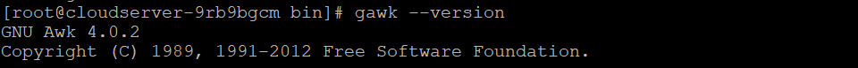
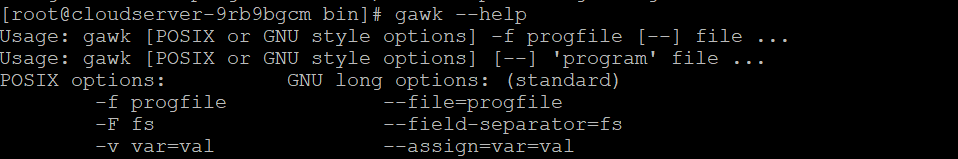

## Introduction

In this article you will learn how to install Gawk on CentOS.

GNU [GAWK](https://en.wikipedia.org/wiki/Gawk) is a free and open source utility that interprets a special-purpose programming language that makes it feasible to do some data formatting tasks with only a few lines of code. GAWK is part of GNU, which is an acronym for the Free and Open Source Software Foundation.

When it comes to making specific changes in text files or extracting some data using only a few lines of code, it offers a clear advantage over some of the more renowned programming languages such as C and Pascal. This is because it provides an obvious advantage. It is possible to install it quickly in practically all of the well-known distributions of Linux.

##### Step 1: Update the Packages

**Before continuing with the steps to install Gawk on your system, it is recommended that you first bring all of the currently installed packages up to date with the newest version by using the command sudo apt update, as shown further down in this article.**

```
# yum update -y

```


##### Step 2: Installation of Gawk

**In the following stage, you will be able to install the gawk software from the default CentOS repository by using the command yum install gawk, as shown in the following section. The package, as well as any dependencies it requires, will be downloaded and installed at this point.**

```
# yum install gawk

```


##### Step 3: Check the version of Gawk

**After installing gawk, you can use the gawk --version command, as shown below, to see what version of gawk you have.**

```
# gawk --version

```



##### Step 4: Check up all the options

**If you want to see all of the options that are available with the gawk command, use the --help option, as shown below.**

```
# gawk --help

```



## Conclusion

Hopefully, now you have learned how to install Gawk on CentOS.

**Also Read:** [How to Use Iperf to Test Network Performance](https://utho.com/docs/tutorial/how-to-use-iperf-to-test-network-performance/)

Thank You 🙂
