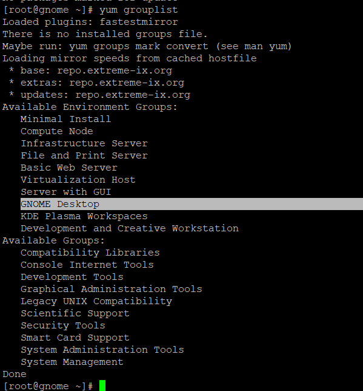
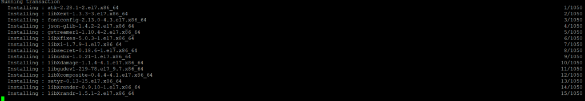
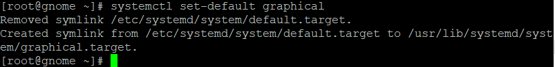
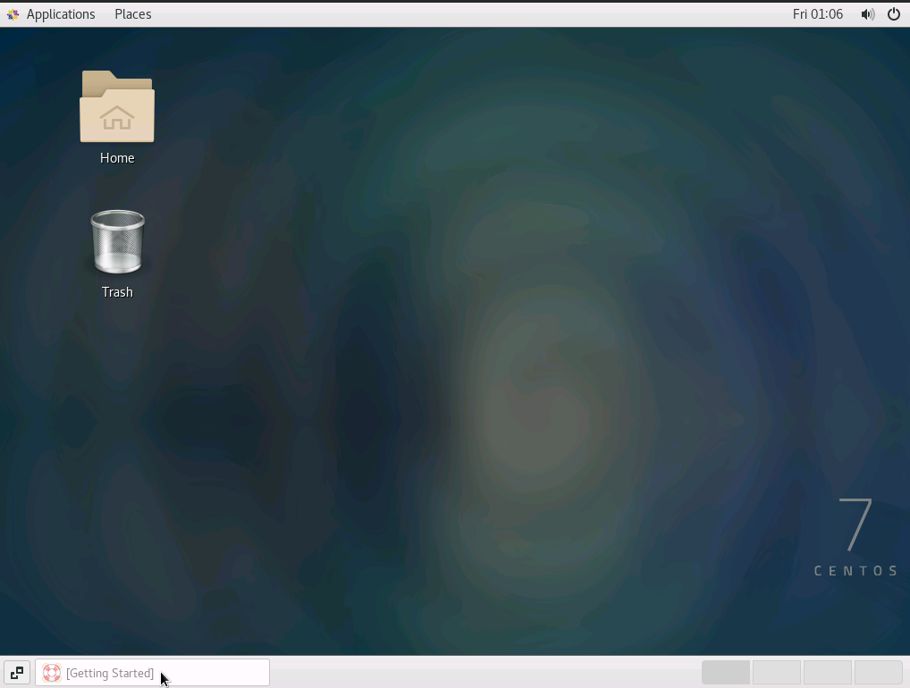

Description

I will walk you through the process of installing GNOME Desktop (GUI) on CentOS 7, starting with the very first step. GNOME is a desktop environment that features a graphical user interface that is open-source and free to use. It is compatible with the vast majority of Linux distributions. It was initially made available to the public in 2011 and had fundamental features such as the ability to start applications and navigate between windows. GNOME was originally developed for people who used desktop computers, but it has since been modified to work with a wide range of different systems. Using the Yum package manager, this graphical user interface (GUI) environment may be quickly downloaded and set up. We are going to go over each stage in great depth. Additional information from the official documentation for GNOME

## Prerequisites

a) You must have a RHEL/CentOS 7 system operating.

b) To run privileged commands, you must have sudo or root access.

c) The Yum utility should be installed on your system.

## Update server

Before installing a new package, it is always a good idea to use the yum update command to update the system with the most recent available versions, as shown below. If any of the packages require upgrading, use the yum upgrade command to do so.

```
yum update
```


## Examine the package groups  the package groups 

Using the yum grouplist or yum group list command, you can view all of the available package groups. As you can see from the output below, we simply need to install the GNOME Desktop and Graphical Administration Tools package groups.

```
yum grouplist
```


## Install GNOME Desktop (GUI).

To install the GNOME Desktop and Graphical Administration Tools package groups, run the yum groupinstall "GNOME Desktop" or yum groupinstall "GNOME Desktop" and "Graphical Administration Tools" commands, as shown below.

```
yum groupinstall "GNOME Desktop" "Graphical Administration Tools"
```


## Enable Gnome (GUI)



## Reboot Server

```
reboot
```
## Set up GNOME Desktop (GUI). 

After rebooting, you should be able to see the GNOME Desktop environment, as shown below.



You have completed the installation of that package effectively.

GNOME Desktop (GUI) on CentOS 7. GNOME has an open-source, free graphical user interface. It supports most Linux distributions. It was first released in 2011 and had basic features like application launch and window navigation. GNOME was originally designed for desktop computers, but it now works with many others. Yum package manager can quickly download and install this GUI environment.

Thankyou
