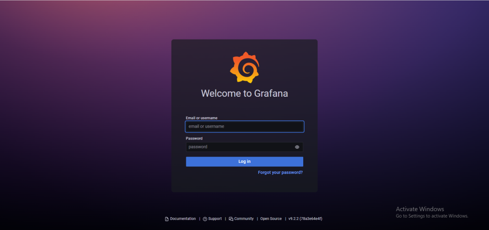

## Introduction

In this article, you will learn how to Install Grafana on Centos 7.

[Grafana](https://en.wikipedia.org/wiki/Grafana) is a free monitoring and data visualisation application that works across multiple platforms. It provides insightful analytics by rendering your data in graphical form and is cross-platform. It is possible to create dynamic dashboards that can be reused, to explore metrics by means of ad hoc queries, to set up alert rules for critical metrics that are constantly evaluated and notify relevant parties of any changes, and to collaborate with members of the team by means of in-built sharing. These are just some of the many features that this software possesses. In addition to that, it enables access to other systems like Graphite, Prometheus, Elasticsearch, and InfluxDB. This guide will walk you through the process of installing Grafana on a server that is running Centos 7

## New Grafana features

Panels in a user's library can be used on several dashboards thanks to this feature.

The Prometheus metrics browser enables you to locate metrics and relevant labels in a short amount of time, which you can then use to construct fundamental queries.

Alerts from Grafana managed alerts and Prometheus-compatible [data sources](https://utho.com/docs/tutorial/how-to-install-gradle-on-centos-7/) are consolidated into a single user interface (UI) and application programming interface (API).

It is now possible for data sources to update dashboards in real time using a websocket connection, a technology known as "real-time streaming."

An alternative to the traditional bar chart for representing categorical data.

Histograms, previously buried in the Graph panel, are now available in their own representation.

The State timeline display tracks the emergence of new conditions throughout time.

The ability to view time series data has passed from beta and into a stable phase.

The log results from inspecting a panel are now downloadable as a text (.txt) file.

## Step 1: Install Grafana on CentOS 7 

The newest version of Grafana, 6, is ready for download and installation. Complement your computer with the Grafana RPM repository.

```
# vi /etc/yum.repos.d/grafana.repo
```

Add the following content to the file:

```
[grafana]name=grafanabaseurl=https://packages.grafana.com/oss/rpmrepo_gpgcheck=1enabled=1gpgcheck=1gpgkey=https://packages.grafana.com/gpg.keysslverify=1sslcacert=/etc/pki/tls/certs/ca-bundle.crt
```

save and exit the file with escape: wq 

To get started with grafana, add the repository and then install the grafana rpm package.

```
# yum -y install grafana
```

View additional information regarding the package you have installed.

```
# rpm -qi grafana
```


## Step 2: Start Grafana service on CentOS 7

Using the systemctl service management command, Grafana may be launched and set to regularly start with CentOS 7:

```
# systemctl enable --now grafana-server
```

It's believed that the service will be in a "running" state.

```
# systemctl status grafana-server
```


## Step 3: Access Grafana Dashboard

Simply open your web browser, navigate to http://Server IP:3000/, and you will have access to the Grafana Web Interface without having to use a reverse proxy. Take, for instance:

```
# http://192.0.2.10:3000
```



## Conclusion

You have Grafana installed on your server successfully. A screen prompting you to log in will appear. Please use admin as both your username and your password. Now that you have access, you can go ahead and configure the Dashboard so that you can start controlling and analysing your data.

I hope you have learned how to Install Grafana on Centos 7.

Thank You 🙂
