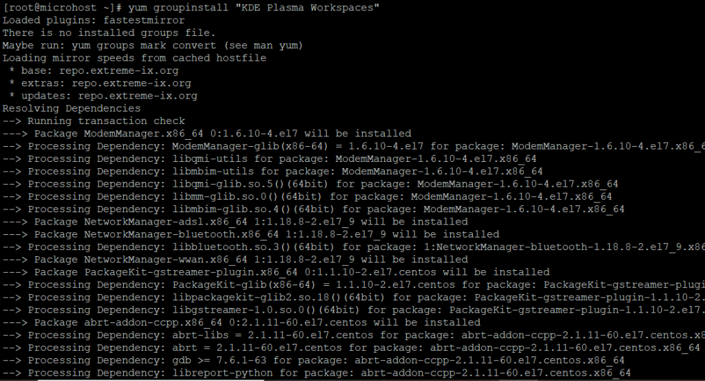
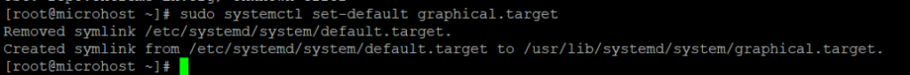

<figure>


<figcaption>

How to Install KDE Desktop(GUI) on CentOS 7

</figcaption>

</figure>

**Description**

In this article we will learn How to Install [KDE](https://en.wikipedia.org/wiki/KDE) Desktop(GUI) on CentOS 7 I'll show you how to install KDE Desktop (GUI) on CentOS 7 step by step. KDE is powerful desktop software that works on more than 200 different platforms and can run more than 200 programmes. It is used a lot on Linux desktops and other digital platforms. KDE makes it easy to find your way around and gives you a lot to do, like play music, surf the web, talk to family and friends, manage your files and data, and do other important work. Find out more on the website. It has a strong community behind it that builds and maintains all of the desktop software's apps.

Proceed in the following manner: How to Install [KDE](https://utho.com/docs/tutorial/laravel-application-hosting-in-plesk/) Desktop(GUI) on CentOS 7

Step 1: Update Server

Before installing packages, it is highly recommended to first install all available updates with the yum update command and then upgrade the packages to the latest version with the yum upgrade command, i have already updated my server as shown below.

```
yum update && yum upgrade
```


## Step 3: Checking Groups Of Packages

With the yum grouplist command, you can see a list of all the package groups that can be installed right now. In the output, you should see a group called "KDE Plasma Workspaces" in the list of package groups.

```
yum grouplist
```


## Step 3: Install KDE Desktop(GUI) package

To install KDE Desktop (GUI), use the command yum groupinstall "KDE Plasma Workspaces" to install the KDE Plasma Workspaces package group.

```
yum groupinstall "KDE Plasma Workspaces"
```


Step 4: Enable KDE Desktop (GUI)

Following a successful installation, you will need to enable the graphical user interface (GUI) mode to start automatically by executing the sudo systemctl set-default graphical.target command, as demonstrated below.

```
sudo systemctl set-default graphical.target
```


## Step 5: Reboot Server

To enable KDE Desktop, use the reboot command to restart your machine, as illustrated below.

```
reboot
```
I truly hope that you will be able to follow each step in the process carefully. How to Install KDE Desktop(GUI) on CentOS 7

Must read :- https://utho.com/docs/tutorial/2-methods-for-re-running-last-executed-commands-in-linux/

**Thankyou**
