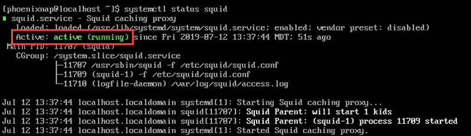

#### Prerequisites:

- CentOS operating system
- Access to a terminal window/command-line (Ctrl-Alt-T)
- A CentOS user with root or sudo priviledges
- The **yum package installer**, included by default
- A text editor, such as **vim**

**Let's begin the installation.**

Login to your server via Putty.

**Step 1:** Refresh CentOS Software Repositories

```
 sudo yum -y update 
```

**Step 2:** Install Squid Package on CentOS

```
 yum -y install squid 
```

Now start Squid by entering the following command:

```
 systemctl start squid 
```

To set up an automatic start at boot:

```
 systemctl enable squid 
```

Review the status of the service, use:

```
 systemctl status squid 
```

In the example below, we see that the state is ‘Active.’



#### **Configuring the Squid Proxy Server**

The Squid configuration file is found at **/etc/squid/squid.conf.**

1\. Open the file in your preferred text editor (**vim** was used in this example}:

```
 sudo vi /etc/squid/squid.conf 
```

2\. Navigate to find the **http\_port option**. Typically, this is set to listen on **Port 3218**. This port usually carries TCP traffic. If your system is configured for traffic on another port, change it here:


You may also set the proxy mode to **transparent** if you’d like to prevent Squid from modifying your requests and responses.

Change it as follows:

```
 http_port 1234 transparent 
```

3\. Navigate to the **http\_acacess deny all** option.

It is currently configured to block all HTTP traffic, and no web traffic is allowed as shown below.


Change this to the following:

```
 http_access allow all 
```

4\. Restart the Squid service by entering:

```
 sudo systemctl restart squid 
```

Squid Proxy Server successfully installed.

Thank You!
