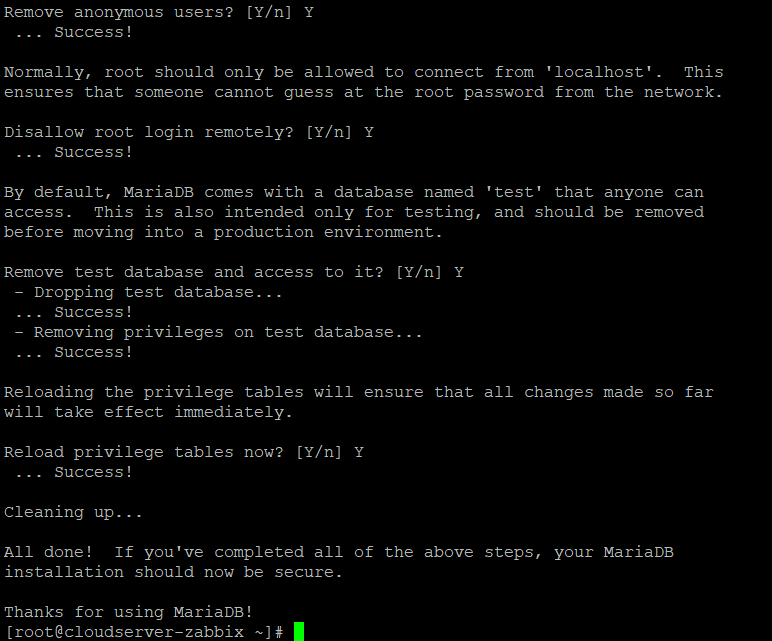
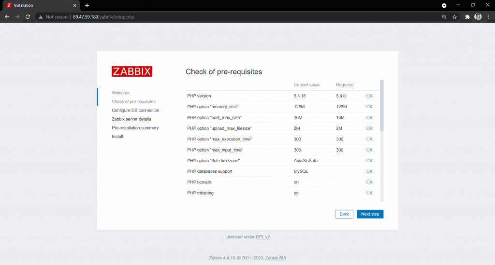
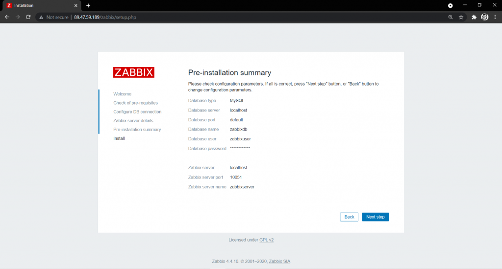
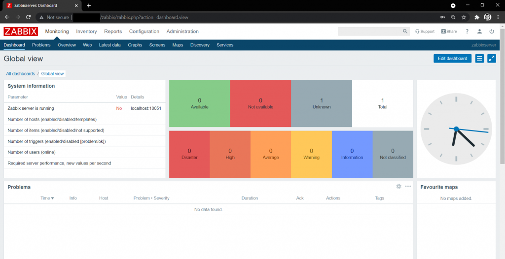

**1. Login to the server via Putty (SSH port 22)**


**2. Set the SELinux in disabled mode, use the following command and reboot your server**.

```
# # sed -i 's/^SELINUX=.*/SELINUX=disabled/g' /etc/selinux/config 
```

**3\. Restart the server by running**

 ```
 # reboot 
```

4**. Install apache and mariadb**

```
# yum update 
```

```
# yum install httpd mariadb-server -y 
```

**5\. Start Apache and mariaDB Services.**

```
# systemctl enable httpd && systemctl start httpd 
```

```
 # systemctl enable mariadb && systemctl start mariadb 
```

**6. Set Mariadb root Password:**

a.      Run:  # [mysql\_secure\_installation](https://manastri.blogspot.com/2019/09/securing-mysql-mariadb-with.html)

b.      It'll ask for setting the root password. Press Y to do so.


c.      disallow remote root login

d.      Remove anonymous user

e.      it'll drop test databases



**7.  Install Zabbix Server with MySQL**

```
# # rpm --import [http://repo.zabbix.com/RPM-GPG-KEY-ZABBIX](http://repo.zabbix.com/RPM-GPG-KEY-ZABBIX) 
```

```
# rpm -Uvh [https://repo.zabbix.com/zabbix/4.4/rhel/7/x86_64/zabbix-release-4.4-1.el7.noarch.rpm](https://repo.zabbix.com/zabbix/4.4/rhel/7/x86_64/zabbix-release-4.4-1.el7.noarch.rpm) 
```

8**. Now use the below command to install Zabbix and necessary packages**

```
# yum install zabbix-server-mysql zabbix-web-mysql zabbix-agent zabbix-get zabbix-sender zabbix-java-gateway -y
```

**9\. Edit PHP timezon**e

```
# vi /etc/httpd/conf.d/zabbix.conf 
```

**9\. Edit PHP timezone**

```
# vi /etc/httpd/conf.d/zabbix.conf 
```

<figure>


<figcaption>

Save the file and exit.

</figcaption>

</figure>

1**0.  Restart httpd service using the below command**:

```
# systemctl restart httpd
```

**11. Edit create and import initial zabbix database and user:**

```
# mysql -u root -p
```


\[filecode file\]

Enter password:Welcome to the MariaDB monitor.  Commands end with ; or \\g.Your MariaDB connection id is 10Server version: 5.5.60-MariaDB MariaDB ServerCopyright (c) 2000, 2018, Oracle, MariaDB Corporation Ab and others.  
Type 'help;' or '\\h' for help. Type '\\c' to clear the current input statement.  
**MariaDB \[(none)\]>CREATE DATABASE zabbixdb CHARACTER SET utf8 COLLATE utf8\_bin;**  
Query OK, 1 row affected (0.00 sec)  
**MariaDB \[(none)\]>GRANT ALL PRIVILEGES ON zabbixdb.\* TO zabbixuser@localhost IDENTIFIED BY "**a\_strong\_password**";**  
Query OK, 0 rows affected (0.00 sec)  
**MariaDB \[(none)\]>FLUSH PRIVILEGES;**  
Query OK, 0 rows affected (0.00 sec)  
**MariaDB \[(none)\]>exit**  
Bye

\[/filecode\]

**12.**  **After creating the Zabbix database and user we need to import the zabbix initial database using the below commands:**

```
# zcat /usr/share/doc/zabbix-server-mysql*/create.sql.gz | mysql -u zabbixuser -p zabbixdb 
```

**13.**  **Now we need to edit database configuration in the Zabbix server configuration file zabbix\_server.conf:**

```
# vi /etc/zabbix/zabbix_server.conf 
```

Specify the database name for zabbix , database user name and the password  
DBHost=localhost

DBUser=zabbixuser

DBUser=zabbixuser

DBPassword=YOURPASSWORD

**14.**  **Now enable and start zabbix service:**

```
# systemctl enable zabbix-server
```

 ```
# systemctl start zabbix-server&&systemctl enable zabbix-agent 
```

```
 # systemctl start zabbix-agent 
```

**15.**  **Setup Zabbix Web Frontend**

Navigate to [http://ip\_address/zabbix](http://ip_address/zabbix) or [http://host\_name/zabbix](http://host_name/zabbix)

<figure>


<figcaption>

click Next

</figcaption>

</figure>



**16.  Please enter DataBase details:**


**18.  Summary:**



**19.  Finish the installation:**


**20.**  **Login Prompt:**

**Default username and password is "Admin" & "zabbix"**




Thank You :)
