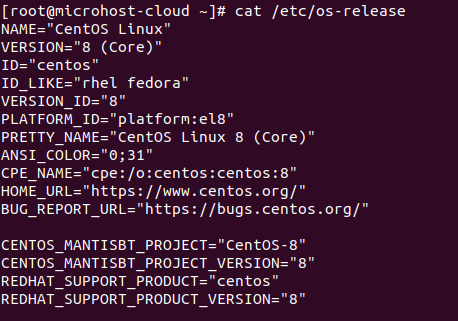
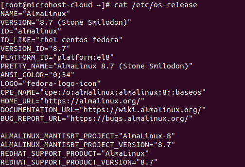

<figure>


<figcaption>

How to migrate from CentOS 8 to Arch Linux 8.7

</figcaption>

</figure>

In this article, you will see how to migrate from CentOS 8 to Arch Linux 8.7. But before that let's see what is Arch Linux. AlmaLinux (opens new window) is an enterprise Linux distribution that is Open Source and will always be free. It is run by the community and focuses on long-term stability and a strong production-grade platform. AlmaLinux OS is exactly the same as RHEL® in every way. The AlmaLinux OS Foundation was set up as a 501(c)(6) non-profit to take care of the project's ownership and management.

CentOS and RedHat announced the end of life (EOL) for CentOS Linux on December 8, 2020. They also told others to shift their attention to the CentOS Stream project.

CentOS and Red Hat said that CentOS 8 would be supported until 2029 after it came out.

But because of a recent announcement, we know that CentOS Linux 7, which is based on RHEL 7, will continue to be supported, and its lifecycle will end in June 2024, just like RHEL 7.

But updates and support for CentOS Linux 8 will go on until December 31, 2021, and there won't be a CentOS Linux 9.

## Caution !

Despite the fact that our migration proceeded smoothly and without a problem, we still strongly advise that you back up all of your files just in case. As they say, it's better to be secure than sorry, and you want to be protected in case something goes wrong.

## Prerequisites

- Super User or any normal user with SUDO privileges.
- Internet enabled CentOS 8 server

## Steps to Migrate CentOS 8 to Arch Linux

Step 1: AlmaLinux conversion requires CentOS 8.4 or 8.5. Before switching to AlmaLinux, it is advised to upgrade to 8.5, though it is not necessary if you are running CentOS 8.4 or higher. If your system recently got new updates, rebooting is advised.

```
yum clean all && yum upgrade -y
init 6
```
Step 2: Ensure your Operating System.

```
cat /etc/os-release
```
or 

```
cat /etc/redhat-release
```
<figure>



<figcaption>

Before migrating OS

</figcaption>

</figure>

Step 3: The CentOS 8 mirrorlists are no longer available as of January 31, 2022. Your dnf configuration files need to be updated to refer to a legitimate mirror in order to complete dnf update -y successfully. You can update dnf to version 8.5 and then install AlmaLinux by using the accompanying sed commands, which are provided for your convenience.

```
sed -i -e '/mirrorlist=http:\/\/mirrorlist.centos.org\/?release=$releasever&arch=$basearch&repo=/ s/^#*/#/' -e '/baseurl=http:\/\/mirror.centos.org\/$contentdir\/$releasever\// s/^#*/#/' -e '/^\[baseos\]/a baseurl=https://mirror.rackspace.com/centos-vault/8.5.2111/BaseOS/$basearch/os' /etc/yum.repos.d/CentOS-Linux-BaseOS.repo
sed -i -e '/mirrorlist=http:\/\/mirrorlist.centos.org\/?release=$releasever&arch=$basearch&repo=/ s/^#*/#/' -e '/baseurl=http:\/\/mirror.centos.org\/$contentdir\/$releasever\// s/^#*/#/' -e '/^\[appstream\]/a baseurl=https://mirror.rackspace.com/centos-vault/8.5.2111/AppStream/$basearch/os' /etc/yum.repos.d/CentOS-Linux-AppStream.repo
sed -i -e '/mirrorlist=http:\/\/mirrorlist.centos.org\/?release=$releasever&arch=$basearch&repo=/ s/^#*/#/' -e '/baseurl=http:\/\/mirror.centos.org\/$contentdir\/$releasever\// s/^#*/#/' -e '/^\[cr\]/a baseurl=https://mirror.rackspace.com/centos-vault/8.5.2111/ContinuousRelease/$basearch/os' /etc/yum.repos.d/CentOS-Linux-ContinuousRelease.repo
sed -i -e '/mirrorlist=http:\/\/mirrorlist.centos.org\/?release=$releasever&arch=$basearch&repo=/ s/^#*/#/' -e '/baseurl=http:\/\/mirror.centos.org\/$contentdir\/$releasever\// s/^#*/#/' -e '/^\[devel\]/a baseurl=https://mirror.rackspace.com/centos-vault/8.5.2111/Devel/$basearch/os' /etc/yum.repos.d/CentOS-Linux-Devel.repo
sed -i -e '/mirrorlist=http:\/\/mirrorlist.centos.org\/?release=$releasever&arch=$basearch&repo=/ s/^#*/#/' -e '/baseurl=http:\/\/mirror.centos.org\/$contentdir\/$releasever\// s/^#*/#/' -e '/^\[extras\]/a baseurl=https://mirror.rackspace.com/centos-vault/8.5.2111/extras/$basearch/os' /etc/yum.repos.d/CentOS-Linux-Extras.repo
sed -i -e '/mirrorlist=http:\/\/mirrorlist.centos.org\/?release=$releasever&arch=$basearch&repo=/ s/^#*/#/' -e '/baseurl=http:\/\/mirror.centos.org\/$contentdir\/$releasever\// s/^#*/#/' -e '/^\[fasttrack\]/a baseurl=https://mirror.rackspace.com/centos-vault/8.5.2111/fasttrack/$basearch/os' /etc/yum.repos.d/CentOS-Linux-FastTrack.repo
sed -i -e '/mirrorlist=http:\/\/mirrorlist.centos.org\/?release=$releasever&arch=$basearch&repo=/ s/^#*/#/' -e '/baseurl=http:\/\/mirror.centos.org\/$contentdir\/$releasever\// s/^#*/#/' -e '/^\[ha\]/a baseurl=https://mirror.rackspace.com/centos-vault/8.5.2111/HighAvailability/$basearch/os' /etc/yum.repos.d/CentOS-Linux-HighAvailability.repo
sed -i -e '/mirrorlist=http:\/\/mirrorlist.centos.org\/?release=$releasever&arch=$basearch&repo=/ s/^#*/#/' -e '/baseurl=http:\/\/mirror.centos.org\/$contentdir\/$releasever\// s/^#*/#/' -e '/^\[plus\]/a baseurl=https://mirror.rackspace.com/centos-vault/8.5.2111/centosplus/$basearch/os' /etc/yum.repos.d/CentOS-Linux-Plus.repo
sed -i -e '/mirrorlist=http:\/\/mirrorlist.centos.org\/?release=$releasever&arch=$basearch&repo=/ s/^#*/#/' -e '/baseurl=http:\/\/mirror.centos.org\/$contentdir\/$releasever\// s/^#*/#/' -e '/^\[powertools\]/a baseurl=https://mirror.rackspace.com/centos-vault/8.5.2111/PowerTools/$basearch/os' /etc/yum.repos.d/CentOS-Linux-PowerTools.repo
```
Step 4: Download the [almalinux-deploy.sh](https://github.com/AlmaLinux/almalinux-deploy/blob/master/almalinux-deploy.sh) script:

```
curl -O https://raw.githubusercontent.com/AlmaLinux/almalinux-deploy/master/almalinux-deploy.sh
```
Step 6: Change the file permission to make the newly downloaded script executable.

```
chmod +x almalinux-deploy.sh
```
Step 5: Execute the script and review the results for mistakes:

```
./almalinux-deploy.sh
```
<figure>


<figcaption>

Running Alma Linux script

</figcaption>

</figure>

After successfully completion of the script, you will recieve the below message as a confirmation!

<figure>


<figcaption>

MIgration done from Centos 8 to Alma Linux

</figcaption>

</figure>

Step 6: Rebooting is advised if using the AlmaLinux kernel to boot:

```
reboot
```
Step 7: Now, confirm the OS release by the command we have executed in step 2

```
cat /etc/os-release
```
<figure>



<figcaption>

OS version after migrating

</figcaption>

</figure>
