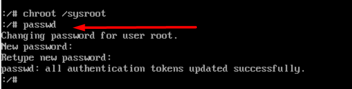

First, reboot or power on your **CentOS 8** system. Select the kernel that you want to boot into. Next, press `‘e’` to interrupt the boot process and make changes.


Replace the kernel parameter `ro` with `rw` and append an extra kernel parameter `init=/sysroot/bin/sh`.


Press **Ctrl+x** combination on the keyboard to enter single-user mode.

Next, run the command below to mount the root file system in read and write mode.

```
chroot /sysroot
```


You can now change the root password by executing the command:

```
passwd
```



To apply the changes, exit and reboot the CentOS 8 system.


Thankyou.
