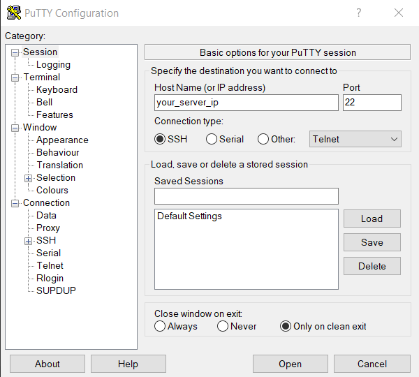
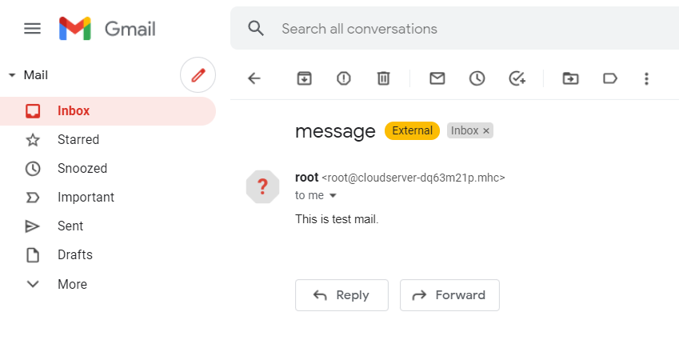

Postfix is a flexible mail server that is available on most Linux distribution. Though a full feature mail server, Postfix can also be used as a simple relay host to another mail server, or smart host.

**Step 1. Login to your server via SSH Putty.**



**Step 2. Install Postfix, the SASL authentication framework, and mailx.**

```
 # yum -y install postfix cyrus-sasl-plain mailx
```

**Step 3. Restart Postfix to detect the SASL framework.**

```
 # systemctl restart postfix 
```

**Step 4.  Start Postfix on boot**

```
# systemctl enable postfix 
```

**Step 5. Open the /etc/postfix/main.cf file.**

```
# vi /etc/postfix/main.cf 
```

Paste the following into the file:

```file {title="/etc/postfix/main.cf" lang="aconf"}
relayhost = [[smtp.gmail.com](http://smtp.gmail.com/)]: 
smtp_use_tls = yes  
smtp_sasl_auth_enable = yes  
smtp_sasl_password_maps = hash:/etc/postfix/sasl_passwd  
smtp_tls_CAfile = /etc/ssl/certs/ca-bundle.crt  
smtp_sasl_security_options = noanonymous  
smtp_sasl_tls_security_options = noanonymous
```

Save and Exit.  
```
 :wq 
```

**Step 6.  Configure Postfix SASL Credentials**

Add the Gmail credentials for authentication. Create a "/etc/postfix/sasl\_passwd" file

```
 # touch /etc/postfix/sasl_passwd 
```

Add the following line to the file:

```file {title="/etc/postfix/main.cf" lang="aconf"}
[[smtp.gmail.com](http://smtp.gmail.com/)]:username:password
```

Save and exit.  
```
 :wq 
```

NOTE: Replace username with your **Gmail ID** and password with your **Gmail Password**

**Step 7.  Create a Postfix lookup table from the sasl\_passwd text file by running the following command:**

```
# postmap /etc/postfix/sasl_passwd 
```

**Step 8. Sending mail**

Run the following command to send mail:  
```
 # echo "This is test mail." | mail -s "message" xyz[@yahoo.com](mailto:xxxxx@yyy.com) 
```

**NOTE:**  '[**xyz@yahoo.com**](mailto:xyz@yahoo.com)' can be any Mail ID that the user wants to send email to.  
**'This is test mail'** is the Body Message of the Email. Customizable according to the user.  
**'message'** is the Subject of the Email. Customizable according to the user.

**Step 9. Mail received.**



Thank You!
