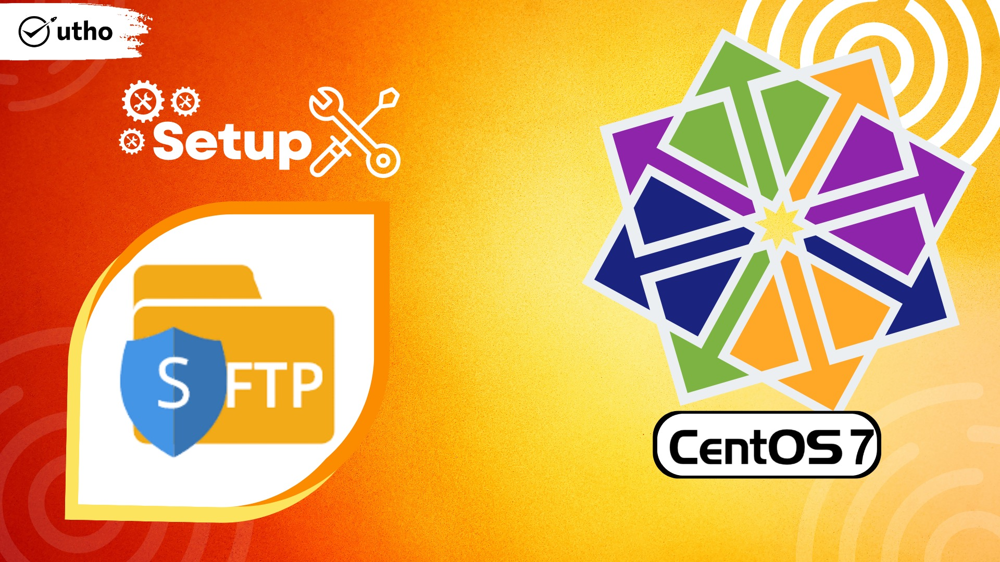

## Introduction

In this article, you will learn how to Setup SFTP-only user account on CentOS 7.

By reading the information contained in this article. It is possible that a Systems Administrator will occasionally need to create a new user account for a user who will have no access to the system other than the ability to manage their own files via SFTP. This post will provide you with a solution to the problem that you are having and show you how to fix it.

In addition, if you are not currently logged in as root, you will require access to the sudo command in order to carry out the steps outlined in this article.

## Step 1: Create a dedicated sFTP group and a dedicated sFTP user

```
# groupadd sftpusers
```

```
# useradd -g sftpusers -s /sbin/nologin microhost
```

```
# passwd microhost
```

## Step 2: Modify the configuration of the sshd service

Open the sshd service's configuration file:

```
# vi /etc/ssh/sshd_config
```

Find the line:

```
Subsystem sftp /usr/libexec/openssh/sftp-server
```

Replace it with:

```
Subsystem sftp internal-sftp
```

Please add the following lines to the end of the file. The sftpusers group name must match the one you provided in the previous step.

```
Match Group sftpusers
X11Forwarding no
AllowTcpForwarding no
ChrootDirectory %h
ForceCommand internal-sftp
```

Save and quit by escape :wq

After making modifications, the sshd service must be restarted for them to take effect.

```
# systemctl restart sshd.service
```

## Step 3: Create a dedicated directory for the sFTP-only user

For the sFTP-only user, you must choose a folder and limiting their access to that folder's contents:

```
# chown -R root /home/microhost
```

```
# chmod -R 755 /home/microhost
```

```
# mkdir /home/microhost/files
```

```
# chown microhost. /home/microost/files
```

Now, the user microhost can only upload or download files in the directory /home/microhost/files. He or she can never touch other users' files.

Know **[How to Install Varnish Cache with Apache on CentOS 7](https://utho.com/docs/tutorial/how-to-install-varnish-cache-with-apache-on-centos-7/)**

## Conclusion

Hopefully, you have learned how To Setup SFTP-only User Account on [CentOS](https://en.wikipedia.org/wiki/CentOS) 7

Thank You 🙂
