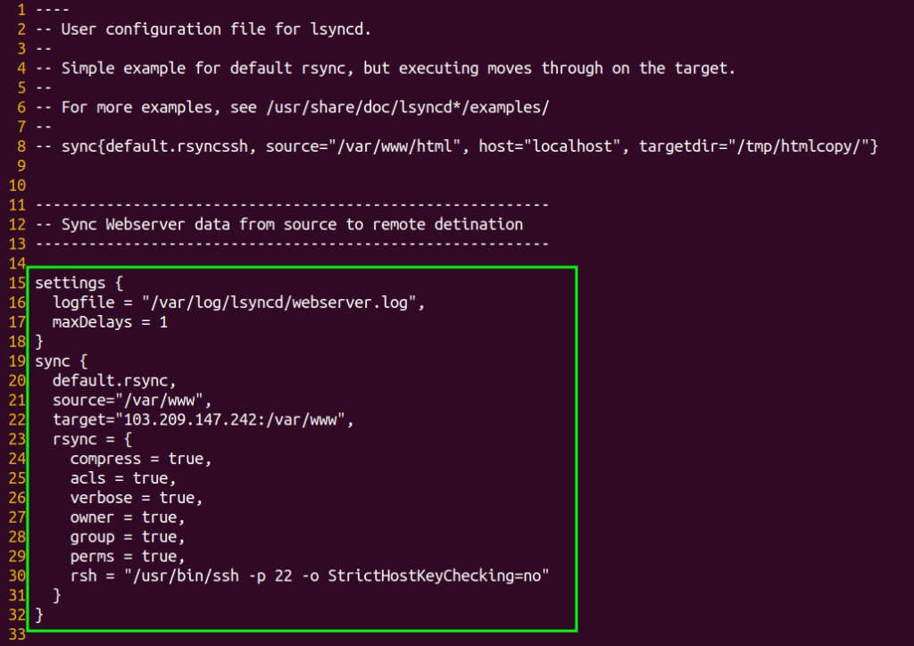

---

<figure>


<figcaption>

How to use lsyncd to sync directory on centos

</figcaption>

</figure>

## What is lsync?

Although [rsync is a superb and flexible backup solution,](https://utho.com/docs/tutorial/how-to-use-rsync-to-sync-local-and-remote-directories/) it does have one drawback: you must manually launch it whenever you want to back up your data. Yes, you can use cron to set up scheduled backups, but even this approach is unable to offer live synchronisation that is smooth. The lsyncd tool, [a command-line application](https://en.wikipedia.org/wiki/Command-line_interface) that uses rsync to synchronise (or rather mirror) local folders with a remote machine in real time, is what you need if this is what you want.

Lsyncd keeps an eye on the inotify or fsevents local directory trees event monitor interface. For a brief period of time, it gathers and integrates events before spawning one (or more) processes to synchronise the adjustments. By default, rsync is used. Lsyncd is a lightweight live mirror solution that is relatively simple to install, doesn't require new filesystems or block devices, and doesn't degrade the speed of the local filesystem.

Instead of sending the move destination over the wire again, Rsync+ssh is an advanced action configuration that leverages SSH to act on file and directory moves directly on the target.

## Important points

- Two server with password-less authentication enabled on both server for each other.

- Need either a normal user with sudo privileges or sudo user.

- Server 1- 103.127.28.167 and Server 2- 103.209.147.242

- Directory 1- /var/www/ to be sync with /var/www/ directory of other server

- Directory 2- /var/lib/mysql to be sync with /var/lib/mysql directory of other server

## Steps to enable mirror synchronisation

### Setup Password-less authentication

Step 1: Now, generate the SSH key to be used for authentication. Execute the below command on both servers.

```
ssh-keygen
```
After executing the above command, you just need to press enter for rest of the prompts you will get.

Step 2: Copy the public key on other servers to complete the password-less authentication.

```
ssh-copy-id root@server-ip
```
. Please change "server-ip" to the IP address of a computer other than the one you are using to run this command. Here, you will be asked to enter the "server-ip" password.

### Install & configure lsyncd binary

Step 3: Now, install lsyncd on your both machines. To install lsyncd, you need to install epel-release first.

```
yum install -y epel-release
```
yum -y install lua lua-devel pkgconfig gcc asciidoc lsyncd
```
Step 4: Now, open the lsyncd configuration file and comment out the line you see using two dashs(--). Then, copy the text below and paste it into your file.

```
vi /etc/lsyncd.conf
```



substitute the target ip to the IP address of the remote computer you want to sync your directory with. Also, in source, you need to define the directory you want to sync with remote server's directory.

> Content of /etc/lsyncd configuration file.
> 
> ```
> settings {
>   logfile = "/var/log/lsyncd/webserver.log",
>   maxDelays = 1
> }
> sync {
>   default.rsync,
>   source="/var/www",
>   target="103.127.28.212:/var/www",
>   rsync = {
>     compress = true,
>     acls = true,
>     verbose = true,
>     owner = true,
>     group = true,
>     perms = true,
>     rsh = "/usr/bin/ssh -p 22 -o StrictHostKeyChecking=no"
>   }
> }
> ```

Step 5: Now, restart your server lsyncd services on both of your server.

```
systemctl restart lsyncd
```
And this is how you will mirror sync your directory with the directory of remote server or you can say you have learnt how to use lsyncd to sync directories on Centos 7
