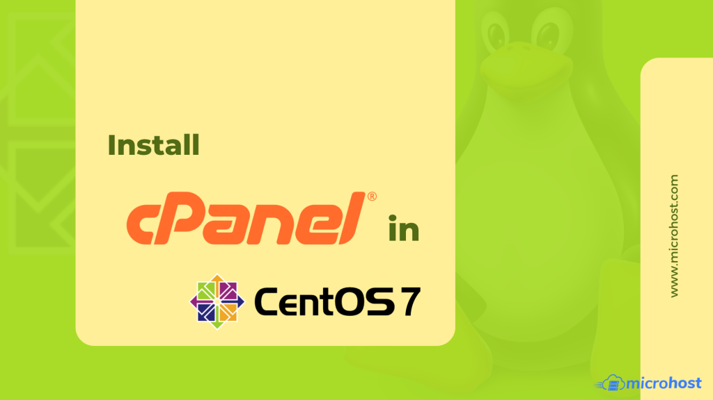
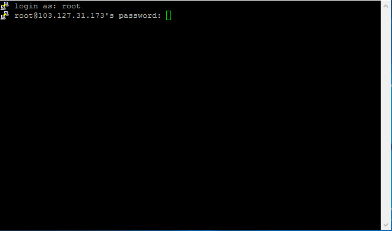
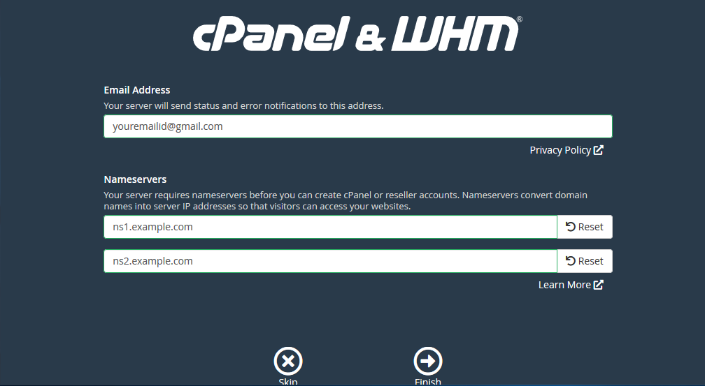
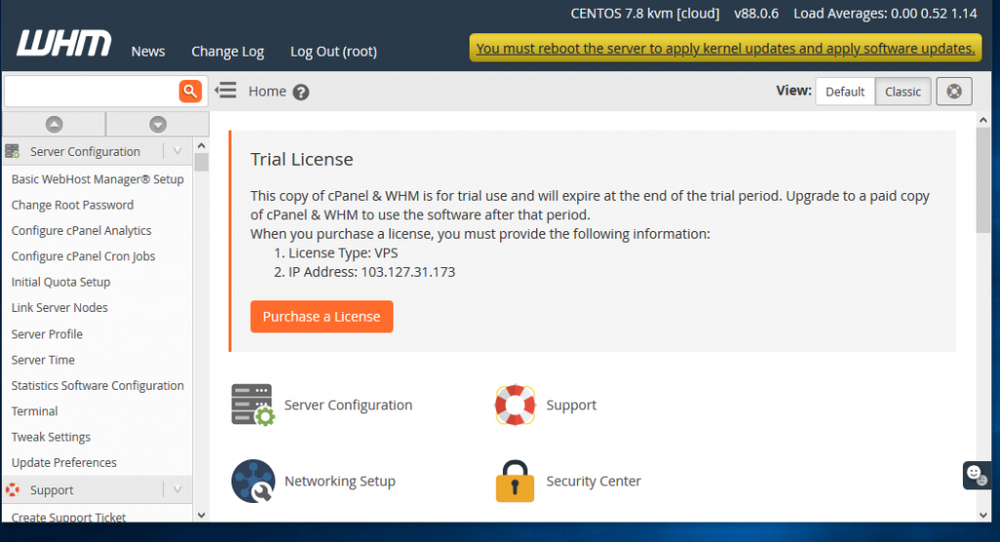

Hardware requirements of WHM/Cpanel


You have sudo user access or root access to install whm/Cpanel.

**Step:- 1.** Access your server using SSH from putty or any third party software.

Here we are using default 22 port for SSH access, If you are using any custom port then mention that port number in port option.


**Step:- 2.** Login as root and enter password of root user.



**Step:- 3.** Set hostname of your Microhost cloud server to install Cpanel and hostname should be pointed to cloud server ip.

```
 [root@cloud ~]# hostnamectl set-hostname cloud.microhost.cloud 
```

**Step- 4.** Disable and stop Networkmanager using below command.

```
 [root@cloud ~]# systemctl stop NetworkManager 
```

```
 [root@cloud ~]# systemctl disable NetworkManager 
```

**Step- 5.** Use below command to install WHM/Cpanel.

```
 [root@cloud ~]# cd /home && curl -o latest -L https://securedownloads.cpanel.net/latest && sh latest 
```

**Step:- 6.** WHM/Cpanel installation is in process and it will take 30 minutes to complete.


**Step:- 7.** Once the installation is completed, the console will display a message like "the cPanel Installation has been completed".

**Step- 8.** WHM/Cpanel installation is completed and now you need to reboot the server and after that access WHM/Cpanel using below URL:-

```
WHM:- serverip:2086 or hostname:2086 Cpanel:- serverip:2082 or hostname:2082 
```


**Step:- 9.** Enter the private nameserver if you want to use private nameserver.



**Step:- 10.** Now WHM/Cpanel has been configured and ready to use.



Thank you..
