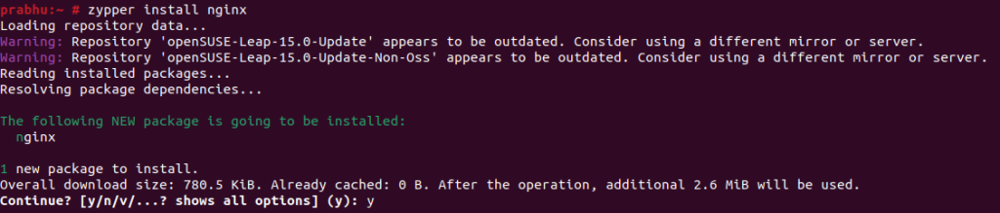
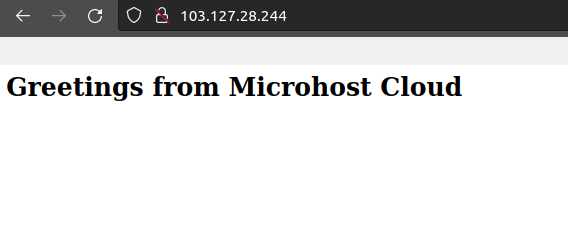

<figure>


<figcaption>

How to install NGINX on OpenSUSE

</figcaption>

</figure>

In this tutorial, you will learn how to install Nginx on OpenSUSE. Free, open-source, [high-performance HTTP and reverse proxy server Nginx](https://www.google.com/url?sa=t&rct=j&q=&esrc=s&source=web&cd=&cad=rja&uact=8&ved=2ahUKEwjotorWsrj_AhXGa2wGHVbeB14QFnoECCgQAQ&url=https%3A%2F%2Fen.wikipedia.org%2Fwiki%2FNginx&usg=AOvVaw3wsfpZ-pf1vTcwsF2F6Bpd)—pronounced "engine X"—is in charge of managing the traffic on some of the busiest websites on the Internet. Both as a standalone web server and as a reverse proxy for Apache and other web servers, Nginx has several uses.

Nginx has a reduced memory footprint per connection and can manage many more concurrent connections than Apache.

## Prerequisites

- A super user or any normal user with SUDO privileges.

- Internet enabled OpenSUSE server

## Steps to install Nginx on OpenSUSE

**Step 1:** Update your server to install the latest patches.

```
zypper update -y
```
Step 2: Install the Nginx on your server.

```
zypper install nginx -y
```
<figure>



<figcaption>

Installing Nginx on Opensuse

</figcaption>

</figure>

Step 3: Start and enable the server to get start using the Nginx server

```
systemctl enable --now nginx
```
<figure>


<figcaption>

Enabling the server

</figcaption>

</figure>

Step 4: Allow the [http and https port on your OS firewall](https://utho.com/docs/tutorial/firewalld-with-centos-7/)

```
firewall-cmd --permanent --add-service=http
firewall-cmd --permanent --add-service=https
firewall-cmd --reload
```
<figure>


<figcaption>

Add http port in firewalld

</figcaption>

</figure>

Step 5: Now, create a test page to test your installation of nginx webserver.

```
echo "<h1> Greetings from Microhost Cloud </h1> >> /srv/www/htdocs/index.html
```

Step 6: Open your browser and access your index.html page.

```
http://<server-ip>
```

<figure>



<figcaption>

Successfully installed apache2 on OpenSUSE

</figcaption>

</figure>

And this is how, you have learnt how to install Nginx on OpenSUSE.
