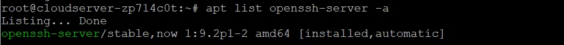

## Introduction

In this article you will learn how to configure SFTP server on Debian 12.

A secure shell (SSH) session is required for the use of the Secure File Transfer Protocol ([SFTP](https://en.wikipedia.org/wiki/SFTP)), which is a secure method for exchanging data between a local and distant computer. It is an upgraded version of the standard file transfer protocol (FTP), which adds an additional layer of protection during the process of transferring files and establishing a connection.

In this tutorial, you will learn how to set up SFTP User accounts on Debian and enable the user to only access files that are located within the user's home directory.

#### Configure SFTP Server In DEBIAN

**Executing the below command confirms that OpenSSH Server was successfully installed.**

```
# apt list openssh-server -a

```



Change the following in **/etc/ssh/sshd\_config**

**In order to stop the sftp server, remove the comment from /usr/lib/openssh/sftp-server.**

**The configuration term "Add Subsystem sftp internal-sftp" allows sshd to use its own SFTP server code rather than starting a separate process (what would typically be the sftp-server).**

**Users in the sftp users group are allowed to using SFTP and not SSH.**

**Specify the SFTP root directory with the command ChrootDirectory /SFTP.**

```
# vi /etc/ssh/sshd\_config

```

**The line below should be uncommented in `/etc/ssh/sshd_config`:**

```
#Subsystem      sftp    /usr/lib/openssh/sftp-server
Subsystem       sftp    internal-sftp
```

**Add the following lines to the end of the file.**

```
Match group sftp_cloud
        X11Forwarding no
        AllowTcpForwarding no
        ChrootDirectory /SFTP
        ForceCommand internal-sftp
```

**Save and close the file by escape :wq**

#### Restart SSH Service

```
# systemctl restart sshd

```

#### Create Users & Group For SFTP

**Create a new group called sftp\_cloud and new user called utho.**

```
# groupadd sftp\_cloud

```

```
# adduser utho

```

**Add user in sftp\_cloud group.**

```
# usermod -G sftp\_cloud microhost

```

**Create /SFTP folder and a sub folder /SFTP/utho for user to upload via SFTP.**

```
# mkdir /SFTP

```

```
# mkdir /SFTP/utho

```

```
# chown utho:sftp\_cloud /SFTP/utho

```

#### Verify SSH & SFTP Access

**Login to SFTP**

**Open a new terminal window and log in with `sftp` using a valid user account and password.**

```
# sftp utho@Server\_IP

```

**List files within the directory. Your output should be similar to the one below:**

utho@Server\_IP's password:

Connected to server\_IP

## Conclusion

In this guide, you successfully set up SFTP on a Debian server, then tested connectivity through a terminal session and FileZilla. You can create multiple users with different directories to securely upload and download files on your server.

Hopefully, you have learned that how to configure SFTP server on Debian 12.

**Also Read:** [How to Use Iperf to Test Network Performance](https://utho.com/docs/tutorial/how-to-use-iperf-to-test-network-performance/)

Thank You 🙂
