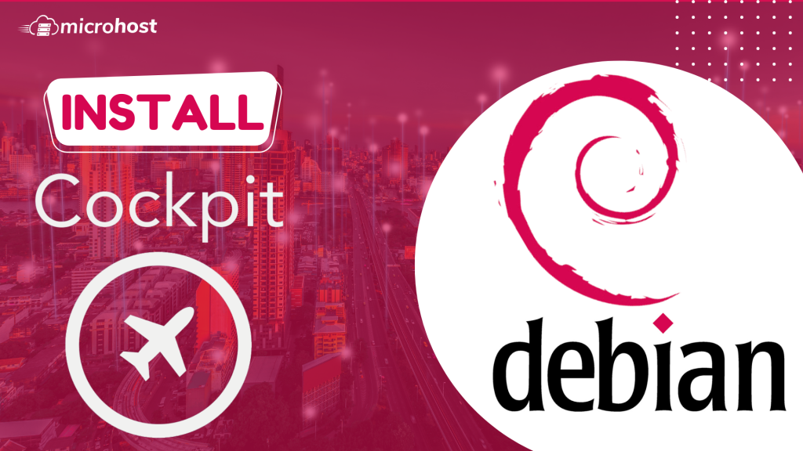
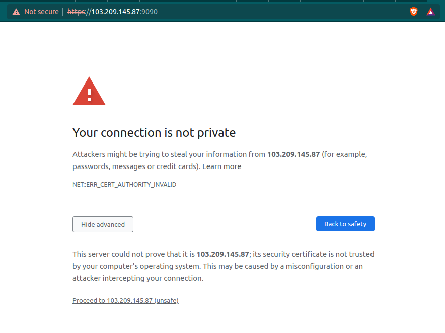

<figure>



<figcaption>

How to install Cockpit on Debian

</figcaption>

</figure>

The [Cockpit](https://cockpit-project.org/) is a web portal that lets you control the configuration settings of your servers through an easy-to-use web interface. It also works as a web console, so you can use your phone or tablet to access it.

The online portal Cockpit gives you access to a wide range of administrative tasks, such as:

- Taking care of service
- Taking care of accounts
- System service management and monitoring
- Setting up network connections and a firewall
- Reviewing system logs
- Managing virtual machines
- Making reports on diagnoses
- Setting kernel dump configuration
- Setting up SELinux
- Changing the software
- Taking care of subscriptions to systems

Because the Cockpit web console and the terminal both use the same application programming interfaces (APIs), any changes made in the terminal are immediately reflected on the web console. You can also change the settings directly through the online portal or the terminal.

## Installing Cockpit Web Console in Debian

Using the command given below, you will be able to install it on your system. With this command, the cockpit and all of its dependencies will be installed.

```
apt update
apt install cockpit
```
Next, turn the controls on and start the cockpit. socket service to use the web interface to connect to the system and check the service while also going through the cockpit procedure.

```
# systemctl start cockpit  
```
# systemctl enable cockpit
```

```

If you are using the ufw firewall on the system, you will need to allow traffic through the cockpit port 9090 in the firewall.

```
ufw allow 9090
```
> Output:
> 
> Rule added  
> Rule added (v6)

## Logging in to the Cockpit Web Console

Follow the steps below to learn how to use a user account that only works on the local system to log in to the Cockpit web interface for the first time. You can use the user name and password of any local account on the system to log in to Cockpit. This is because it uses a PAM stack authentication method that can be found in the /etc/pam.d/cockpit file.

Use your web browser to go to the following URLs to get to the Cockpit's web console:

```
https://server-ip_or_domain-name 
```

Now, you will see the browser page like below. This a simple warning page, you can ignore it by clicking on advanced and 'proceed to \*server-ip\*(unsafe)'

<figure>



<figcaption>

Warning page of domain

</figcaption>

</figure>

Now you will prompt to login page of the cockpit, here enter the details of the username with you want to login.

<figure>


<figcaption>

Login page of Cockpit

</figcaption>

</figure>

Also Read: [How to install SSL on Ubuntu with Apache2](https://utho.com/docs/tutorial/install-ssl-on-ubuntu-with-apache2/), [How to install SSL on Centos-7.3 with Nginx server](https://utho.com/docs/tutorial/ssl-installation-on-centos-7-3-with-nginx-server/)
