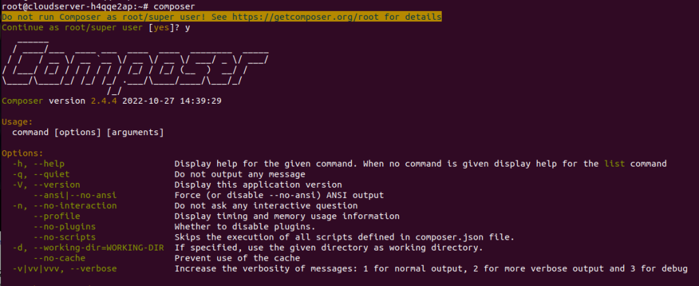

<figure>


<figcaption>

How to install Composer on Debian servers

</figcaption>

</figure>

In this tutorial we will learn how to install Composer on a Debian server. [Composer](http://getcomposer.org/) is a tool for taking care of PHP dependencies. It lets you list the libraries that your project needs, and it will install, update, and manage them for you.

Composer is not like Yum or Apt in that it is not a package manager. Yes, it works with "packages" or libraries, but it handles them per project and installs them in a directory (like "vendor") inside your project. It doesn't install anything everywhere by default. So, it is a manager of dependencies. It does, however, make it easy to work on a "global" project with the "global" command.

This is not a new idea, and node's npm and ruby's bundler were big influences on Composer.

## Prerequisites

- An Debian server with APT repository configured
- Super user( root ) or any Normal user with SUDO privileges.

## 1 — Install Dependencies

First, make sure your package manager's cache is up to date and install the necessary dependencies, including php-cli:

```
apt-get install update
apt install php-cli unzip
```
## 2 — Download and Install Composer

First, make sure you're in the directory where your home files are. Then, use curl to download the Composer installer:

```
curl -sS https://getcomposer.org/installer -o /tmp/composer-setup.php
```
Next, we'll see if the SHA-384 hash of the installation we downloaded matches the SHA-384 hash of the most recent installer, which can be found on the page with the Composer Public Keys/Signatures.

Using curl, you can get the most recent signature, which you can then store in a shell variable:

```
# HASH=\``curl -sS https://composer.github.io/installer.sig`\`

```

Run the following line of PHP code to see if it's a good time to run the installation script:

```
php -r "if (hash_file('SHA384', '/tmp/composer-setup.php') === '$HASH') { echo 'Installer verified'; } else { echo 'Installer corrupt'; unlink('composer-setup.php'); } echo PHP_EOL;"
```
> Output:
> 
> Installer verified

The next command will download and install Composer as a command called composer that can be used all over the system. This command will be found in the directory /usr/local/bin.

```
php /tmp/composer-setup.php --install-dir=/usr/local/bin --filename=composer
```
> Output:
> 
> All settings correct for using Composer  
> Downloading…  
> Composer (version 2.3.5) successfully installed to: /usr/local/bin/composer  
> Use it: php /usr/local/bin/composer

And now, if you want to verify your installation.

```
# composer 
```

<figure>



<figcaption>

Confirmation of installation of Composer

</figcaption>

</figure>

And that is how easily you can install the Composer on your Debian Server.

Also Read: [VirtualHost creation in Tomcat 10/9/8/7](https://utho.com/docs/tutorial/virtualhost-creation-in-tomcat-9-8-7/), [How To Create Redirects with Nginx](https://utho.com/docs/tutorial/how-to-create-redirects-with-nginx/)
