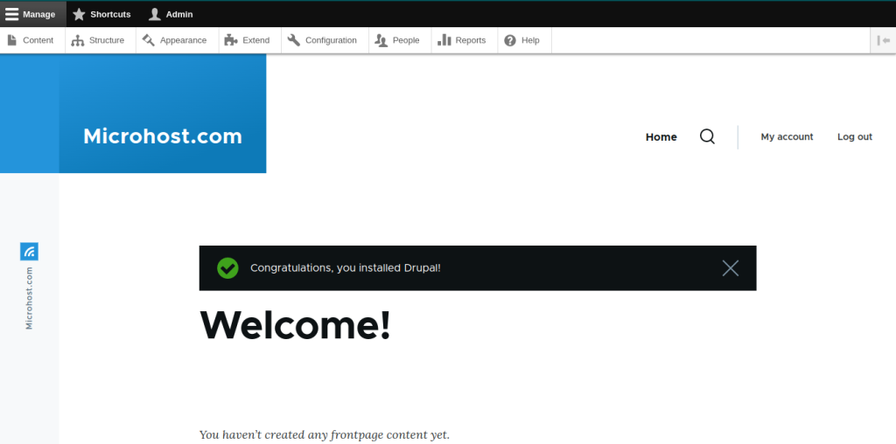

In this post, we'll talk more about how to install Drupal on Debian.

Drupal is a free and open-source content management system that lets us make and change websites without having to learn how to code. The source code for Drupal is written in PHP and is shared under the GNU General Public License (General Public License ).

```
Prerequisites
```
- A apt repository configure debian server
- A super user( root) or any normal user with SUDO privileges

Drupal runs on the front end and is powered by a database server on the back end, just like any other CMS. So, you need to install a [LAMP stack](https://utho.com/docs/tutorial/how-to-install-lamp-on-ubuntu-18-10/) before you install anything else. LAMP is made up of the Apache web server, the MariaDB or MySQL database, and PHP, which is a scripting language that runs on the server

## 1- Create a Drupal Database

First, we'll make a database that Drupal will use to store information during and after the installation. Sign in to the MariaDB database server first.

Once you're in the MariaDB shell, we'll make a database called drupal db.

```
> create DATABASE Microhost_DB;
```

Next, we'll make a database user with a strong password and give that user full access to the Drupal database, as shown.

> CREATE USER ‘Microhost\_user’@’localhost’ IDENTIFIED BY “Password”;  
> **\>** GRANT ALL ON Microhost\_DB.\* TO ‘Microhost\_user’@’localhost’ IDENTIFIED BY “password”;  
> \> FLUSH PRIVILEGES;  
> **\>** EXIT;

Now that we have the Apache web server, the Drupal database, and all the PHP extensions set up, we will move on and download the Drupal installation file.

If you face any PHP error, try installing the below php dependencies too

```
apt install php libapache2-mod-php php-cli php-fpm php-json php-common php-mysql php-zip php-gd php-intl php-mbstring php-curl php-xml php-pear php-tidy php-soap php-bcmath php-xmlrpc
```
## 2- Download and Install Drupal in Debian

We are going to use the wget command to download the compressed file from [Drupal's official](https://www.drupal.org/download) site as shown.

```
wget https://www.drupal.org/download-latest/tar.gz -O drupal.tar.gz
```
Once the download is done, unzip it in the current directory, move the unzipped Drupal folder to the /var/www/html path, and list the directory's contents as shown:

```
tar -xvf drupal.tar.gz# mv drupal-9.0.7 /var/www/html/drupal # ls -l /var/www/html/drupal
```
Next, change the directory permissions so that anyone can use Drupal.

```
chown -R www-data:www-data /var/www/html/drupal/ # chmod -R 755 /var/www/html/drupal/
```
## 3- Create an Apache Virtual Host for Drupal

We need to make an Apache virtual host file to serve Drupal's site on the front end. Make the file as shown using the text editor you like best. The vim editor is being used here.

```
vim /etc/apache2/sites-available/drupal.conf
```
Now fill the opened file with below content

```
<VirtualHost *:80>
     ServerAdmin Microhost.document.com
     DocumentRoot /var/www/html/drupal/
     ServerName  document.com  
     ServerAlias www.document.com

     ErrorLog ${APACHE_LOG_DIR}/drupal_error.log
     CustomLog ${APACHE_LOG_DIR}/drupal_access.log combined

     <Directory /var/www/html/drupal/>;
            Options FollowSymlinks
            AllowOverride All
            Require all granted
     </Directory>

     <Directory /var/www/html/>
            RewriteEngine on
            RewriteBase /
            RewriteCond %{REQUEST_FILENAME} !-f
            RewriteCond %{REQUEST_FILENAME} !-d
            RewriteRule ^(.*)$ index.php?q=$1 [L,QSA]
    </Directory>
</VirtualHost>

```

Save the changes and close the file when you're done.

Up until this point, a browser could only get to the Apache Welcome page. We need to change this so that the Drupal site is served by Apache. We need to turn on Drupal's virtual host in order to do this. So, follow these instructions:

```
a2ensite drupal.conf # a2enmod rewrite
```
And now just restart the apache service by below command

```
systemctl restart apache2
```
Now you just to open your favourite browser and hit for your server\_ip

```
http://server-ip_or_domain-name
```

The below screen will be the first page you will see after hitting your server ip on the browser.

Here, just click on save and continue if you do not want to change the default language.

<figure>


<figcaption>

Homepage of your drupal site

</figcaption>

</figure>

On the next page, you will be asked to select the installation profile. We have selected the standard option for the sake of this tutorial. After making the choice, just again click on save and continue to install Drupal on Debian.

<figure>


<figcaption>

second page of the installation

</figcaption>

</figure>

On the third screen, you will be headed to fill the database information you created for the drupal to save the data. After filling up the details, just continue to your path.

<figure>


<figcaption>

Third page to enter the database details

</figcaption>

</figure>

After clicking on the save and continue option on the last page, you have just started the installation of the drupal on your server

<figure>


<figcaption>

Installation process

</figcaption>

</figure>

After installation, you will be asked to enter the details of your site. Just fill up according to your site.

<figure>


<figcaption>

Enter the domain details on the fifth page

</figcaption>

</figure>

Finally!!! You have Installed Drupal on Debian and configured the drupal on your server successfully. Enjoy

<figure>



<figcaption>

Welcome page of drupal

</figcaption>

</figure>
