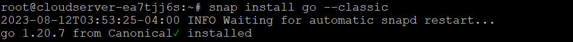

## Introduction

In this article, you will learn how to install Go on Debian 12.

[Golang](https://en.wikipedia.org/wiki/Go_(programming_language)), also known as Go, is an open-source and cross-platform programming language that can be set up on Linux, Windows, and macOS. The language is well-built so that professionals can use it to build applications. Go is easy to build and run, which makes it a great programming language for making software that works well. It is reliable, builds quickly, and has software that works well and can grow quickly.

## Method 1: Using APT

**Apt is a free user interface for software that works with core libraries to install, update, and remove software on Linux operating systems. Here are the steps to install "Go" on Debian 12 using the apt command.**

**Step 1: Replace outdated software packages**

```
# apt update

```

**Step 2: Upgrade system packages**

```
# apt upgrade -y

```

**Step 3: Setting up Go on Debian 1**2

```
# apt install golang-go -y

```

**Step 4: Test the Setup**

```
# go version

```


**Step 5: The process of removing Go on Debian using apt**

**If you want to uninstall Go for whatever reason, here is the apt command to help you do it:**

```
# apt-get remove golang-go

```

## Method 2: Using snap

**Snap store is a way to find, install, and manage software. It is a package management system. Most Linux operating systems, like Debian 12, come with it already set up. But you can use these steps if, for whatever reason, it is not already installed on your Debian system.**

**Step 1: Use the following command to set up Snap:**

```
# apt install snapd

```

**Step 2: Next, run the "snap" command given below to install "go," as shown below:**

```
# snap install go --classic

```



**Step 3: How to delete Go through snap**

**Use the following command to delete Go:**

```
# snap remove go

```


## Conclusion

Hopefully, now you have learned how to install Go on Debian 12.

Also Read: [How to Install NGINX Web Server on Ubuntu 22.04 LTS](https://utho.com/docs/tutorial/how-to-install-nginx-web-server-on-ubuntu-22-04-lts/)

Thank You 🙂
