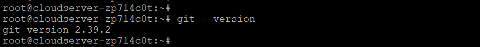
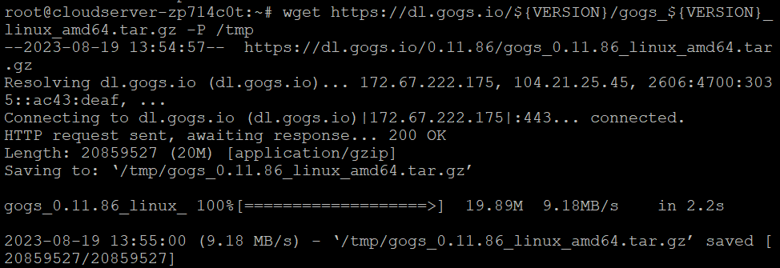

## Introduction

In this article, you will learn how to install Gogs on Debian 12.

Gogs is a git server that is self-hosted and open source. It was created in Go. It comes with a file editor for the repository, tracking for the project issues, and a wiki that is built right in.

Gogs is a lightweight application that may be loaded on low-powered devices because of its low memory and CPU requirements. You should give [Gogs](https://en.wikipedia.org/wiki/Gogs) a shot if you are looking for an alternative to Gitlab that has a significantly smaller memory footprint and if you do not want all of the bells and whistles that Gitlab provides. The steps necessary to install Gogs on Debian are outlined in this tutorial.

## Before You Begin

**All of Gogs' data can be stored in either a SQLite, PostgreSQL, or MySQL/MariaDB database [](https://utho.com/docs/tutorial/how-to-migrate-accounts-from-cwp-to-cwp/)depending on the user's preference.**

**We will be utilising SQLite as our database of choice throughout this course. You can install SQLite on your computer by putting in the following command, if it has not already been done so.**

```
# apt install sqlite3 -y

```

## Installing Gogs

**The Gogs binary will be used for the installation. The process of installation is pretty easy to understand and follow.**

**Installing Git on your server is the first thing you need to do. In order to accomplish this, you must first update the local package index and then install the git package by executing the command below.**

```
# apt update

```

```
# apt install git

```

**Displaying the Git version will allow you to validate the installation.**

```
# git --version

```



**Simply typing in the following command will create a new user account for the Gogs service.**

```
# adduser --system --group --disabled-password --shell /bin/bash --home /home/git --gecos 'Git Version Control' git

```


## Download Gogs binary

**Go to the Gogs Download page to get the most recent version of the binary that is compatible with your architecture. The most recent version, as of this writing, is 0.11.86; however, if there is a newer version available, the VERSION variable in the command that follows should be updated accordingly.**

**The following wget command must be used in order to download the Gogs archive into the /tmp directory:**

```
# wget https://dl.gogs.io/${VERSION}/gogs\_${VERSION}\_linux\_amd64.tar.gz -P /tmp

```



**As soon as the download is finished, extract the Gogs tar.gz file, and then move it into the /home/git directory:**

```
# tar xf /tmp/gogs\_\*\_linux\_amd64.tar.gz -C /home/git

```

**Execute the following command to transfer ownership of the directory containing the Gogs installation to the user and group git:**

```
# chown -R git: /home/git/gogs

```

## Create a systemd Unit File

**Gogs includes a Systemd unit file that, out of the box, is already configured to work with our infrastructure.**

**Simply type in the following command to copy the file into the /etc/systemd/system/ directory:**

```
# cp /home/git/gogs/scripts/systemd/gogs.service /etc/systemd/system/

```

**After that, run the Gogs service and make sure it's enabled:**

```
# systemctl enable gogs

```

```
# systemctl start gogs

```

```
# systemctl status gogs

```


## Install Gogs using the web installer

**It is time to finalise the installation using the web interface now that Gogs has been downloaded and is operating successfully.**

**Open your browser, type `http://your_ip:3000` and a screen similar to the following will appear:**


###### Database Settings:

- Database Type: SQLite3

- Path: Use an absolute path, `/home/git/gogs/gogs.db`

Application General Settings

- Application Name: Enter your organization name

- Repository Root Path: Leave the default `/home/git/gogs-repositories`

- Run User: git

- Domain: Enter your domain or server IP address.

- SSH Port: 22, change it if SSH is listening on other Port

- HTTP Port: 3000

- Application URL: Use http and your domain or server IP address.

- Log Path: Leave the default `/home/git/gogs/log`

**Once done hit the “Install Gogs” button. The installation is instant and when completed you will be redirected to the login page.**

## Conclusion

Hopefully, you have learned how to install Gogs on Debian 12.

**Also Read:** [How to Use Iperf to Test Network Performance](https://utho.com/docs/tutorial/how-to-use-iperf-to-test-network-performance/)

Thank You 🙂
