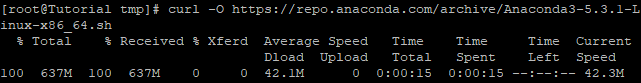
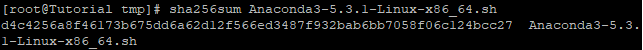

## Introduction

In this article, you will learn how to install Anaconda on Fedora.

[Anaconda](https://en.wikipedia.org/wiki/Anaconda_(Python_distribution)) is a free and open-source version of the [Python and R programming](https://utho.com/docs/tutorial/how-to-install-docker-on-centos-7/) languages designed specifically for use in data science. Its primary goal is to make the administration and deployment of packages more straightforward. Conda, the package management system used by Anaconda, is responsible for managing the various package versions. Conda does an analysis of the present environment before carrying out an installation in order to prevent the installation from interrupting other frameworks and packages.

The Anaconda distribution is pre-configured with more than 250 different packages already installed. In addition to the conda package and the virtual environment manager, PyPI allows for the installation of over 7500 more open-source packages that can be used. In addition to the command line interface, it also comes with a graphical user interface called Anaconda Navigator.

This interface is a graphical replacement for the command line interface. Users are able to run programmes and manage conda packages, environments, and channels without having to use command-line commands thanks to the Anaconda Navigator, which is part of the Anaconda distribution and comes standard with the package. Navigator is capable of conducting a search for packages, installing those packages in an environment, running those packages, and updating those packages.

## Step 1: Update Your System

```
# dnf update -y
```

## Step 2: Download Anaconda

```
# cd /tmp
```

```
# curl -O https://repo.anaconda.com/archive/Anaconda3-5.3.1-Linux-x86_64.sh
```



## Step 3: Verify Installer hashes

After you have downloaded the installer, you can validate the hashes by running the sha256sum command as shown below.

```
# sha256sum Anaconda3-5.3.1-Linux-x86_64.sh
```



## Step 4: Install Anaconda

```
# dnf install bzip2 -y
```

Run the installation script to begin the Anaconda installation process:

```
# bash Anaconda3-5.3.1-Linux-x86_64.sh
```

The programme will greet you and welcome you to the installer before requesting that you read over and agree to the licence conditions. After you have done so, use the Enter button to proceed. Then press CTRL+C.

You are going to be prompted to confirm that you accept the conditions; if you do, type "yes."

You will be prompted by the system to use the default location for the installation.

If you want to continue or specify your location, press the Enter key. In the event that it is necessary, you are free to cancel the installation. Unless you have a specific need to modify the location of the installation, it is advised that you use the location that is specified during the installation.

Do you wish the installer to initialize Anaconda3  
in your /root/.bashrc ? \[yes|no\] type yes

Do you wish to proceed with the installation of Microsoft VSCode? \[yes|no\] type no

## Step 5: Activate the Installation

It is not necessary to restart your current terminal session in order for the modifications to take effect. To activate the installation while you're still in the same terminal session, all you have to do is execute the command source /.bashrc.

```
# source ~/.bashrc
```

```
# condo info
```


## Conclusion

Hopefully, you have learned how to install Anaconda on Fedora.

Thank You 🙂
