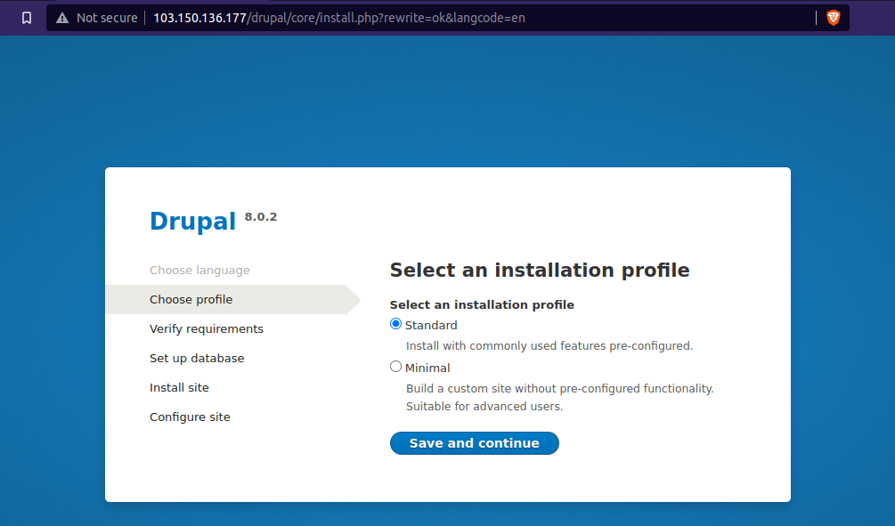
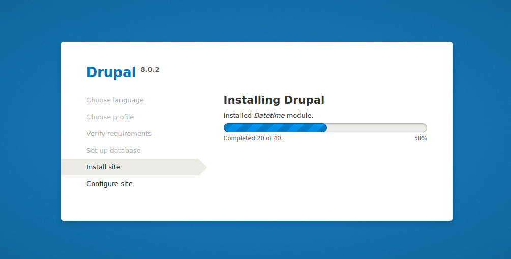
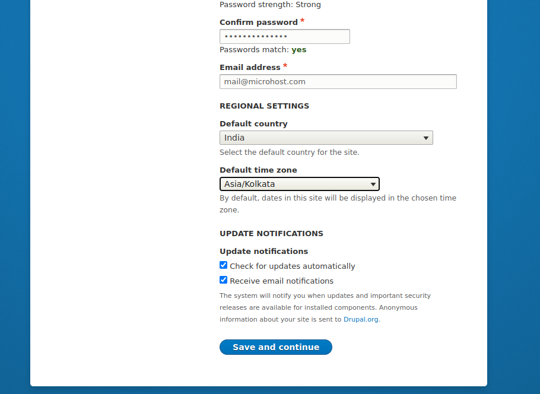

In this post, we'll talk more about how to install Drupal on [Fedora](https://en.wikipedia.org/wiki/Fedora_Linux).

Drupal is a free and open-source content management system that lets us make and change websites without having to learn how to code. The source code for Drupal is written in PHP and is shared under the GNU General Public License (General Public License ).

## Prerequesties

- dnf server configured on your Fedora server
- Apache 2.x (Recommended)
- PHP 5.5.9 or higher (5.5 recommended). To install the latest version of php, [follow this article](https://utho.com/docs/tutorial/how-to-install-latest-versions-of-php-on-centos/).
- MySQL 5.5.3 or MariaDB 5.5.20
- A super user or any other normal user with sudo privileges.

To meet above requirements, you just need to install LAMP server on your machine. Follow this article to [install LAMP on Fedora](https://utho.com/docs/tutorial/installation-of-lamp-stack-on-centos-7/)

## 1- Configure MySQL/ Mariadb database for Drupal

We need to set up both a database and a user for the Drupal site we will be running.

```
mysql -u root -p
```
> \> CREATE DATABASE microhost\_db;  
> \> CREATE USER microhost\_user@localhost IDENTIFIED BY '\-----------';  
> \> GRANT ALL ON microhost\_db.\* TO microhost\_user@localhost;  
> \> FLUSH PRIVILEGES;  
> \> EXIT;

## 2- Install and configure Drupal

First, we'll use the wget function to get the most recent version of Drupal (i.e. 8.2.6). If you don't already have the wget and tar packages on your computer, use the following command to get them:

```
dnf install wget tar -y
```
```
wget https://ftp.drupal.org/files/projects/drupal-8.0.2.tar.gz
```
Use the command given below to get the file you downloaded from Drupal out of its ZIP format. After that, move the folder with Drupal into the /var/www/html directory, which is the Apache Document Root.

```
tar -zxcf drupal-9.4.6.tar.gz # mv drupal-9.4.6 /var/www/html/drupal
```
Then, in the directory (/var/www/html/drupal/sites/default), create the settings file settings.php based on the example settings file default.settings.php. After that, set the correct permissions on the Drupal site directory, including its subdirectories and files, as shown below:

```
cd /var/www/html/drupal/sites/default/
cp default.settings.php settings.php
chown -R apache:apache /var/www/html/drupal/
```
Finally, at this point, go to the URL: http://server IP/drupal/ to launch the online installer, choose your chosen installation language, and click Save to proceed.

```
http://server-ip/drupal 
```

> Note: if your server have php version lower than 5.6, you will encounter the below error when you hit your server-ip on your browser

<figure>


<figcaption>

Error of having lower version than php 5.6

</figcaption>

</figure>

If you have higher than php5.6 you must see the below page. Here, just select save and continue after selecting favourite language

<figure>


<figcaption>

select language

</figcaption>

</figure>

On the next page, you will be asked to select the installation profile. We have selected the standard option for the sake of this tutorial. After making the choice, just again click on save and continue

<figure>



<figcaption>

second page of the installation

</figcaption>

</figure>

On the third screen, you will be headed to fill the database information you created for the drupal to save the data. After filling up the details, just continue to your path.

<figure>


<figcaption>

Third page to enter the database details

</figcaption>

</figure>

After clicking on the save and continue option on the last page, you have just started the installation of the drupal on your server

<figure>



<figcaption>

Installation process

</figcaption>

</figure>

After installation, you will be asked to enter the details of your site. Just fill up according to your site.

<figure>


<figcaption>

Enter the domain details on the fifth page -1

</figcaption>

</figure>

Finally!!! You have installed Drupal on Fedora server and configured the drupal on your server successfully. Enjoy

<figure>



<figcaption>

Welcome page of drupal

</figcaption>

</figure>
