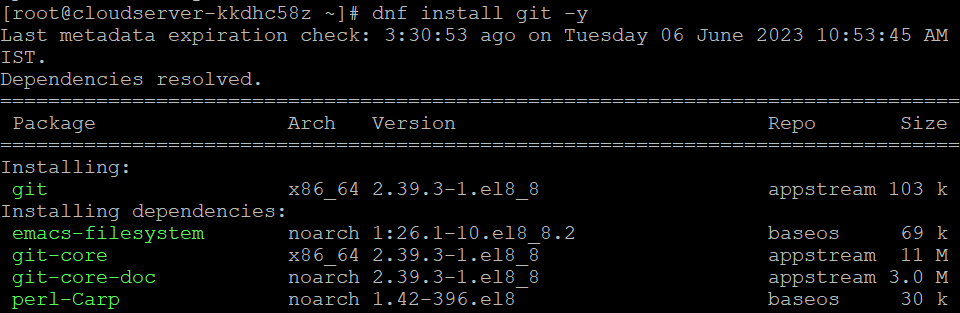

## Introduction

In this article, you will learn how to install Git on Fedora.

[Git](https://en.wikipedia.org/wiki/Git) is a piece of software that allows for the tracking of changes in any set of files, and it is most commonly used for the purpose of coordinating work among a group of programmers who are jointly producing source code during the process of software development.

Git is both free and open source. Its objectives include enhancing speed and data integrity while also providing support for dispersed and non-linear workflows (thousands of parallel branches running on different systems).

Git is a tool that can be used to monitor the history of all the changes that have been made to a project and the files that are associated with it. Git stores all of this information in a central location known as a repository. A repository is a central storage site that houses all of the files associated with a project as well as the revision histories of those files.

##### Step 1: Install Git

**To installed Git, type the following command.**

```
# dnf install git -y

```



**Check that Git was properly installed.**

```
# git --version

```


##### Step 2: Configure Git

**Setting up your name and email address in Git is a necessary procedure.**

**1\. Set your name.**

```
# git config --global user.name "utho"

```

**2\. Set your email address.**

```
# git config --global user.email "abc@utho.com"

```


##### Step 3: Verify the settings

```
# git config --list

```


## Conclusion

Hopefully, you have learned how to install Git on Fedora.

**Also Read:** [How to Use Iperf to Test Network Performance](https://utho.com/docs/tutorial/how-to-use-iperf-to-test-network-performance/)

Thank You 🙂
