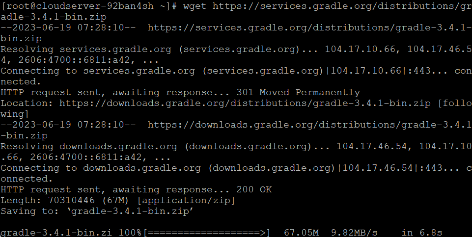

## Introduction

In this article, you will learn how to install Gradle on Fedora.

[Gradle](https://en.wikipedia.org/wiki/Gradle) is a build automation tool for making software in more than one language. It handles the whole development process, to gather and packaging to testing, deploying, and publishing. Java, C/C++, and JavaScript are among the programmes that can be used.

## Step 1: System update

**It is actually recommended that you update the system on the Fedora server instance you are using before installing any packages. To bring the system up to date, you will need to log in as the sudo user and then perform the following instructions.**

```
# dnf install [https://dl.fedoraproject.org/pub/epel/epel-release-latest-8.noarch.rpm](https://dl.fedoraproject.org/pub/epel/epel-release-latest-8.noarch.rpm) --skip-broken

```

```
# dnf -y update

```

## Step 2: Install JDK

**In order to function, Gradle needs a version of the Java Development Kit (JDK) that is 7 or above. The installation of JDK 8 will be covered in this guide. To install JDK 8 on your server, you will need to run the following command.**

```
# dnf -y install java-1.8.0-openjdk wget unzip

```


**Using the above command will also install the wget and unzip programmes. Make sure the installation is correct.**

```
# java -version

```


## Step 3: Download Gradle

**There are two different varieties of the Gradle distribution archive: "binary-only" and "complete." The "full" package includes not only the binary but also the documentation and the source code for the Gradle programme. The "binary-only" archive just contains the Gradle software itself. In order to download Gradle to your computer, use the following command.**

```
# wget https://services.gradle.org/distributions/gradle-3.4.1-bin.zip

```



## Step 4: Install Gradle

**Create a directory for the Gradle installation to take place in.**

```
# mkdir /opt/gradle

```

**Extract the archive that you downloaded into the directory that you just established.**

```
# unzip -d /opt/gradle gradle-3.4.1-bin.zip

```

**Set the value of the PATH environment variable so that the gradle executable may be run in any directory on the system.**

```
# export PATH=$PATH:/opt/gradle/gradle-3.4.1/bin

```

**To determine whether or not the Gradle installation was successful, you may check by using the following command.**

```
# gradle -v

```


## Conclusion

Hopefully, you have learned how to install Gradle on Fedora.

**Also Read:** [How to Use Iperf to Test Network Performance](https://utho.com/docs/tutorial/how-to-use-iperf-to-test-network-performance/)

Thank You 🙂
