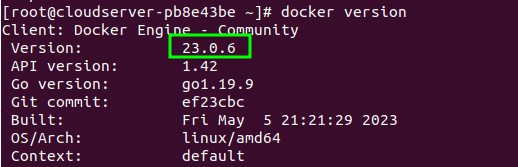

<figure>


<figcaption>

How to install Minikube on Fedora server

</figcaption>

</figure>

In this tutorial, we will learn How to install Minikube on Fedora server. Minikube is free software that lets you set up a small Kubernetes cluster with a single computer. The software starts up a virtual machine and runs a [Kubernetes cluster](https://kubernetes.io/docs/concepts/overview/) inside of it. This lets you test directly in a Kubernetes environment.

## Prerequisites

- A normal user with SUDO privileges or Super user
- Yum repositories configured to install packages.

## Steps to install Minikube on Fedora.

Step 1: Update your machine

```
yum -y update
```

Step 2: Install EPEL repositories using below command.

```
 yum -y install epel-release
```

Step 3: Install libvirt packages, dependencies to run Minikube

```
yum -y install libvirt qemu-kvm virt-install virt-top libguestfs-tools bridge-utils
```

Step 4: Now run, enable and check the status of libvirt daemon to ensure it is running and installed successfully.

```
systemctl enable --now libvirtd
systemctl status libvirtd 
```

Step 5: Now, add your any normal user to libvirt group by using usermod command.

```
usermod -a -G libvirt <normal-username>
usermod -a -G libvirt prabhu      # my normal user 
```

Step 6: Now, append the below mentioned details to the below file.

```
vi /etc/libvirt/libvirtd.conf
```

> Append contend to above file::
> 
>   
> unix\_sock\_group = "libvirt"
> 
> unix\_sock\_rw\_perms = "0770"

Step 7: Restart the libvirtd daemon/ service to reflect the changes.

```
systemctl restart libvirtd.service
```

### Download Minikube binary

Step 8: Download and install the minikube binary using the curl and install using the command as shown below.

```
curl -LO https://storage.googleapis.com/minikube/releases/latest/minikube-linux-amd64
sudo install minikube-linux-amd64 /usr/local/bin/minikube
```

Step 9: Check the version installed of your minikube.

```
minikube version
```

<figure>


<figcaption>

Minikube install on Fedora

</figcaption>

</figure>

### Download Kubectl binary and installed it

Step 10: Download the [latest kubectl](https://utho.com/docs/tutorial/deploying-and-managing-a-cluster-on-microhost-kubernetes-engine-mke/) binary using the below command

```
curl -LO https://storage.googleapis.com/kubernetes-release/release/`curl -s https://storage.googleapis.com/kubernetes-release/release/stable.txt`/bin/linux/amd64/kubectl
```

Step 11: Now, make the binary executable, so the it can be run

```
chmod +x kubectl
```

Step 12: Move the binary to /usr/loca/bin directory so that it can be run from anywhere of your machine.

```
mv kubectl /usr/local/bin
```

Step 13: Check the version installed on your Fedora machine

```
kubectl version --client -o json
```

<figure>


<figcaption>

Version of installed kubectl

</figcaption>

</figure>

### Install Docker container

Step 14: Now, without, docker environment, you cannot run minikube. Therefore, run the below command to add the repolist to your machine to install Docker.

```
 yum install -y yum-utils
 yum-config-manager --add-repo https://download.docker.com/linux/fedora/docker-ce.repo
```

Step 15: Install the docker related dependencies to run your minikube.

```
yum install docker-ce docker-ce-cli containerd.io docker-buildx-plugin docker-compose-plugin
```

Step 16: Now, run the below command to enable and start the docker service instantly

```
systemctl enable --now docker
```

Step 17: Check the docker running version.

```
docker version
```

<figure>



<figcaption>

Docker installed on Fedora

</figcaption>

</figure>

Step 18: Now, add your normal user( user which is added to libvirt group in earlier step) to the docker group as well.

```
usermod -aG docker prabhu
```

Step 19: Now, switch to that user and run the minikube with driver docker as a default driver.

```
su - prabhu 
minikube start --driver=docker
```

<figure>


<figcaption>

Minikube installed and running on Fedora

</figcaption>

</figure>

And, that's how, you have learnt how to install Minikube on Fedora server.
