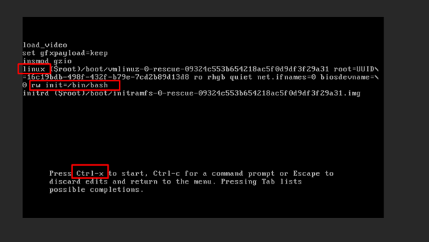
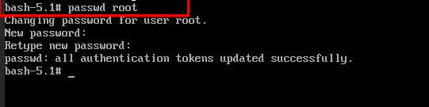

**Resetting Password in Fedora 34**

**For resetting password Reboot the server and interrupt booting process by pressing up and down arrow key and press e button from keyboard**

**After that find the line starting with linux and append that line with “rw init=/bin/bash”** **And then press Ctrl+x**

**Now enter passwd command for resetting password**

**#passwd root**

**Now reboot the system by using /sbin/reboot -f command**

**#sbin/reboot -f**

**Now After reboot you can access your server with new** password

**Thankyou** :)
