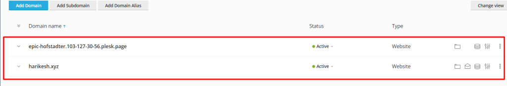
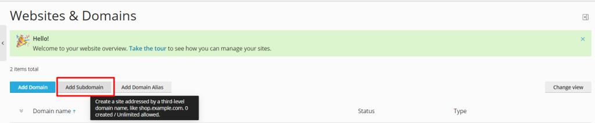

**Intoroduction**

In this article you will know How to ADD OR DELETE DOMAINS AND SUBDOMAIN IN PLESK,

**Domain**\=The word "domain" may be used to refer to the structure of the internet, which is unique to the [world wide web](https://en.wikipedia.org/wiki/World_Wide_Web). Domain can also be used to refer to the manner in which an organization's network resources are arranged. In general, a domain may be thought of as either a sphere of knowledge or an area of control.

**Subdomain**: Subdomains are the components of a domain that appear before the primary domain name and the extension of the domain. They can assist you in the organisation of your website. For instance, you may visit docs.themeisle.com. The subdomain that is represented by this URL is docs.

**1.click on the website and domains**

2.Add domain

**3.Fill out the data fields with information regarding the domain you wish to add.**

\*On the left-hand menu click website and domains

\*After that, select the "Add Domain" option that is seen in the following screenshot.

\*Select **Temporary domain name** or **Registered domain name**

\*Fill out the data fields with information regarding the domain you wish to add

\*Now that you've added a domain, take a look at the screenshot down below.

**\*\* How to add a subdomain\*\***

**1.click on the website and domains**

**2.Add subdomain**

**3.Fill the required filleds**

\*On the left-hand menu click website and domains

\*After that, select the "Add sub domain" option that is seen in the following screenshot.

- Fill the required filleds and then click ok

\*Now that you've added a sub domain, take a look at the screenshot down below.

\*\*The steps necessary to delete domains and subdomains\*\*

\*Click the three dots that are located on the right side.\*

\*Click remove website\*

Know, **[How To find Apache version in Plesk](https://utho.com/docs/tutorial/how-do-i-find-my-apache-version-in-plesk/)**

**Thank You**
