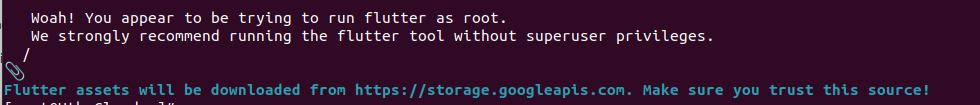

<figure>


<figcaption>

How to install Flutter on RockyLinux 8

</figcaption>

</figure>

In this article, you will learn how to install Flutter on RockyLinux 8. The [Google Flutter Software Development Kit](https://www.google.com/url?sa=t&rct=j&q=&esrc=s&source=web&cd=&cad=rja&uact=8&ved=2ahUKEwjDkcjXh87_AhXwTWwGHT1DAWkQFnoECCwQAQ&url=https%3A%2F%2Fen.wikipedia.org%2Fwiki%2FFlutter_(software)&usg=AOvVaw1z7ttZfRm6kiLnu3vpU37s&opi=89978449) (SDK) is a free and open-source tool for creating cross-platform mobile applications. Flutter enables programmers to create high-performance, scalable applications for Android or iOS that have aesthetically pleasing and useful user interfaces using a single platform-independent codebase. With the help of a library of pre-made widgets, Flutter enables even non-programmers and non-developers to swiftly launch their own mobile applications.

Flutter, which was developed by Google in 2015 and formally released in 2018, has swiftly taken over as the preferred toolkit for developers. Flutter recently eclipsed React Native to take the top spot among mobile app development frameworks, according to Statista.

## Prerequesites

- Any normal user with SUDO privileges or Super user

- yum repositories configured with [RocyLinux server.](https://utho.com/docs/tutorial/microhost-product-details/)

## Steps to install Flutter on RockyLinux server

Step 1: Before installing the Snap on your server, you need to install the extra packages for enterprises linux( EPEL) repsitories

```
yum install epel-release
```
<figure>


<figcaption>

Installing EPEL repo

</figcaption>

</figure>

Step 2: Install the Snap by executing the below command

```
yum install snapd
```
<figure>


<figcaption>

Install the Snap on RockyLinux

</figcaption>

</figure>

Step 3: Start and enable the snapd socket to start working with snapd

```
systemctl enable --now snapd.socket
```
```
Output-
Created symlink from /etc/systemd/system/sockets.target.wants/snapd.socket to /usr/lib/systemd/system/snapd.socket.

Step 4: Now, you must enter the following to establish a symbolic link between /var/lib/snapd/snap and /snap in order to enable support for traditional snaps:
```

```
ln -s /var/lib/snapd/snap /snap
```
Step 5: Now, either set the PATH varialbe using the below command or restart another terminal

```
echo export PATH=$PATH:/snap/bin >> ~/.bashrc
```
```
export .bashrc
```
Step 6: Check the snapd version.

```
snap version
```
<figure>


<figcaption>

Version of Snap

</figcaption>

</figure>

Step 7: Install flutter on your server .

```
snap install flutter --classic
```
Step 8: Add the flutter tool to your path:

```
export PATH="$PATH:`pwd`/flutter/bin"
```
Step 9: Install the pre-defined binaries of flutter

```
flutter precache
```


And this is how you will install Flutter SDK on RockyLinux 8.
