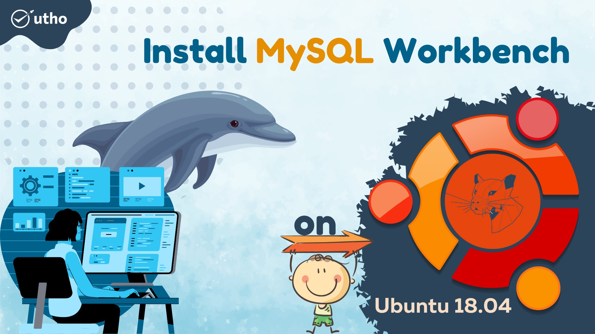
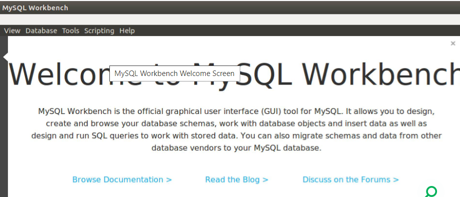

**Description**

For MySQL servers and databases, MySQL Workbench is a graphical and visual database designing tool. It has been purposely developed with the intention of assisting database administrators, developers, and database architects in graphically designing, generating, modeling, and managing databases. Working with databases is intended to be a breeze using MySQL Workbench because to its user-friendly and uncomplicated interface. It is possible to create several models inside the same environment and it supports all objects, including as tables, views, triggers, and stored procedures. Additionally, it includes this capability.

In this tutorial, we will install MySQL server on one Ubuntu 18.04 server, install MySQL workbench on another Ubuntu 18.04 desktop, and then connect MySQL server with the interface provided by MySQL Workbench.

**Prerequisites**

Bringing your system up to date:

```
#sudo apt-get update
```

**Get MySQL Workbench installed**

\*Utilizing the APT package manager, install MySQL Workbench:

```
#sudo apt install mysql-workbench
```

**Start MySQL's development environment.**

Begin using MySQL Workbench from the command prompt:

```
#mysql-workbench
```

Utilize the —help option while working from the command line interface to obtain a full list of available launch options:

```
/usr/bin/mysql-workbench --help
```

When started for the first time, MySQL Workbench presents the following greeting screen:



installed successfully............... continue reading 

**Conclusion**

MySQL Workbench is a database design tool for MySQL servers and databases. It was created with the objective of enabling database administrators, developers, and database architects in graphically creating, producing, modelling, and maintaining databases. Because of its user-friendly and straightforward interface, MySQL Workbench is designed to make database administration a snap. It is possible to create many models inside the same environment, and it supports all objects, such as tables, views, triggers, and stored procedures. It also has this potential.

In this tutorial, we will install MySQL server on one Ubuntu 18.04 server, MySQL Workbench on another Ubuntu 18.04 desktop, and then connect MySQL server to the interface offered by MySQL Workbench.

**Thankyou**
