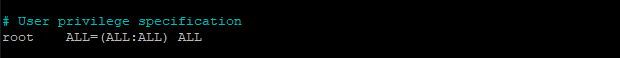
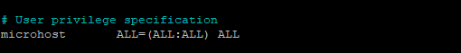

## Introduction

In this article you will learn, how to add a user and grant root privileges on Ubuntu 18.04.

A system administrator's duties can include adding users and giving them administrative access. Once a user is added and given root access, they will be able to log in to your Ubuntu VPS and execute system-level tasks. After that, they can issue commands with enhanced privileges by prefixing them with [sudo](https://en.wikipedia.org/wiki/Sudo). With this brief guide, you'll learn how to create a new user and give them administrative privileges.

## Step 1: I will add a user that is microhost

```
# adduser microhost
```

Enter the new value, or press ENTER for the default  
Full Name \[\]: press ENTER  
Room Number \[\]: press ENTER  
Work Phone \[\]: press ENTER  
Home Phone \[\]: press ENTER  
Other \[\]: press ENTER  
Is the information correct? \[Y/n\] press y


## Step 2: Grant Root Privileges to the User

```
# visudo
```

The above command takes us to the /etc/sudoers.tmp file, where we can see the code below:



After the line for the root user, you will add the same format for your new user. This will let us give that user admin rights.



Press "ctrl" and "x" together. Press "y" and then "enter" at the prompt to save and close the file.

## Step 3: Verify User Has Privileges

If you've done everything right, this user will be able to run commands like update with the help of sudo:

```
# su - microhost
```

```
# sudo apt-get update
```


After entering the password, this is shown in the below terminal


## conclusion

Hopefully, you have learned how to add a user and grant root privileges on Ubuntu 18.04.

Also read: [How to prevent a user from login in Linux](https://utho.com/docs/tutorial/how-to-prevent-a-user-from-login-in-linux/)

Thank You 🙂
