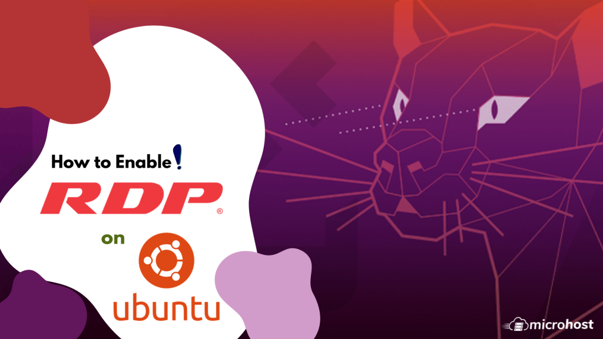
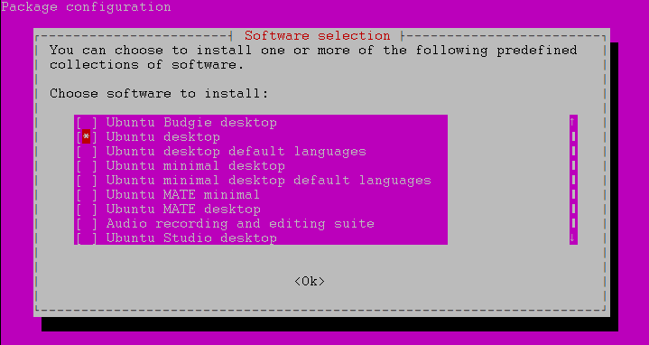
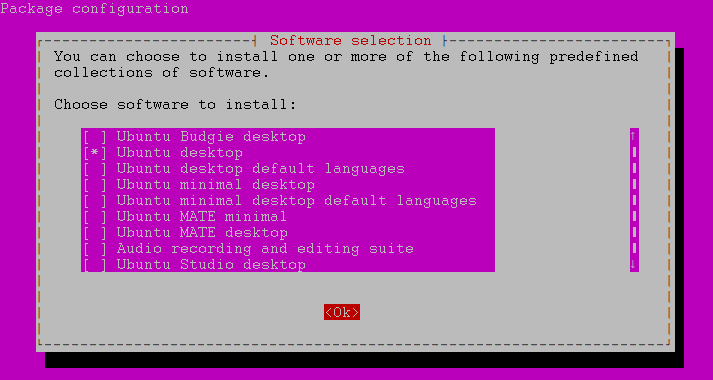
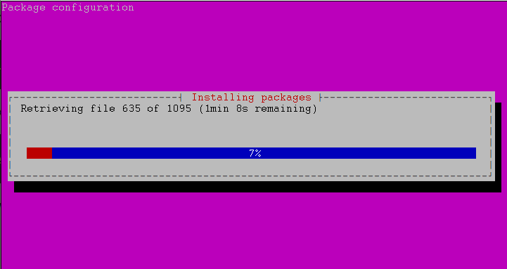

In this Article we will know the process to add XRDP service through Tasksel packages.

First we need to update the Ubuntu OS with help of below command- 
```
 # apt update 
```

After successfully updating the system, I need to install the tasksel packages on the system.

```
 # apt install tasksel 
```

Now need to deploy the tasksel in your system, you need to follow below screenshot steps.  
```
 # tasksel 
```







After successfully install the ubuntu Desktop, you need to reboot the system.

```
 # reboot 
```

Now we have to install the XRDP in system to access the machine from the outside of world  
```
 # apt install xrdp 
```

Now we need to enable the xrdp service in our system  
```
 # systemctl enable xrdp 
```

:: After running the above command, you will get the below result. Now you are able to access your ubuntu machine from outside of the world through RDP access.


Not recommended for all users...  

Some extra features which you may also run to give a look like Windows system to your Ubuntu Desktop.  
  
```
 # apt install gnome-shell-extensions gnome-shell-extension-dash-to-panel gnome-tweaks adwaita-icon-theme-full 
```

```
 # reboot 
```

Click on Activities, then search on search bar Tweaks


Select Dash to panel and Desktop icons


