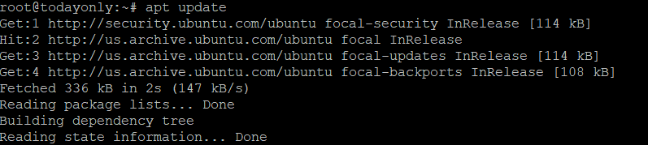
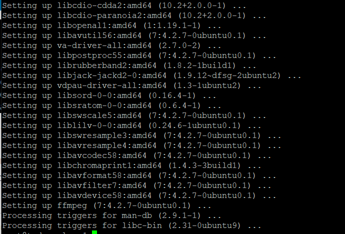
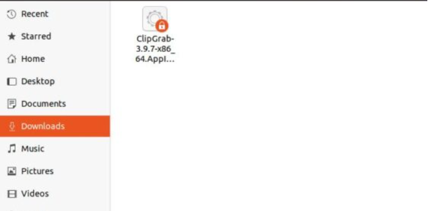

**Description**

Instructions on how to install [ClipGrab](https://en.wikipedia.org/wiki/ClipGrab) in order to download videos from YouTube using Ubuntu 20.04 LTS. ClipGrab is a free video downloader and converter that works with a wide variety of online video platforms in addition to YouTube, including Vimeo, Facebook, and many more. It only takes the press of a mouse to download videos of a very high quality. You also have the option to convert videos to MPEG-4, MP3, and any other format that is currently supported. ClipGrab can be downloaded for use on virtually every platform. In this section, we will go over the steps necessary to instal on systems based on Ubuntu 20.04 LTS.

## Update Server

```
apt update
```
First, we need to use the apt update or apt-get update command to see if there are any new updates for all the configured and enabled repositories.



## Install ffmpeg

To convert and download 1080p videos from YouTube with ClipGrab, you need to instal either ffmpeg or avconv. So, we're going to instal ffmpeg by typing the command apt-get instal ffmpeg, as shown below. If you try to open ClipGrab without installing ffmpeg or avconv, you will get a message that says no installed version of avconv or ffmpeg could be found.

```
apt-get install ffmpeg
```


## Download ClipGrab

Since it's open source, you can compile the source code or use the pre-compiled version. Here, we'll use a pre-compiled package. You can download ClipGrab's newest pre-compiled version for Linux via wget. This downloads the current package.

```
wget https://download.clipgrab.org/ClipGrab-3.9.7-x86_64.AppImage
```


## Add Execute Permission

To make it executable, use the chmod +x ClipGrab-3.9.7-x86 64.AppImage command, as shown below, to give it permission to run.

```
chmod +x ClipGrab-3.9.7-x86_64.AppImage
```
## Open ClipGrab

You can now navigate to the location where you downloaded the pre-compiled package and double-click on it to begin.



Clipgrab has made it possible for you to download videos from YouTube at this time.

Hopefully Now you know How to Install ClipGrab on Ubuntu 20.04 LTS to Download YouTube Videos.

**Must Read** : [Determine All IP Addresses of Live Hosts Connected to the Network in Linux](https://utho.com/docs/tutorial/find-out-all-live-hosts-ip-addresses-connected-on-network-in-linux/)

**Thankyou**
