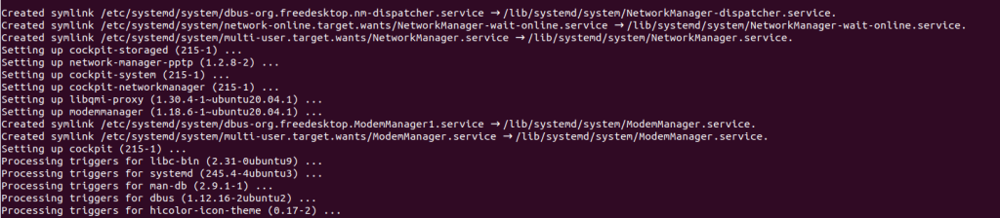
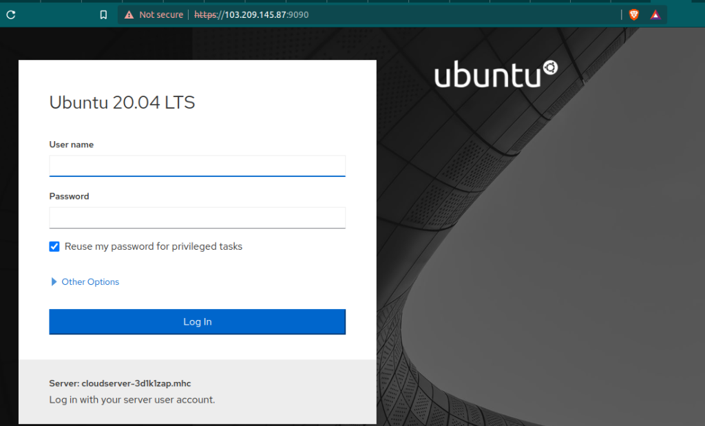

The [Cockpit](https://cockpit-project.org/) is a web console with an easy-to-use web-based interface that lets you manage your servers' settings. Because it is also a web console, you can also use it on your phone or tablet.

You can do a wide range of administrative tasks through the Cockpit web console, such as:

- Taking care of service
- Taking care of accounts
- System service management and monitoring
- Setting up network connections and a firewall
- Reviewing system logs
- Managing virtual machines
- Making reports on diagnoses
- Setting kernel dump configuration
- Setting up SELinux
- Changing the software
- Taking care of subscriptions to systems

The Cockpit web console uses the same system APIs as the terminal, and tasks done in the terminal are quickly reflected in the web console. You can also change the settings directly through the web console or the terminal.

## Installing Cockpit Web Console in Ubuntu

You can install it on your system by using the command below, which will install the cockpit with its required dependencies.

```
# apt update  
apt install cockpit 
```

<figure>



<figcaption>

completion of installation of cockpit

</figcaption>

</figure>

Next, enable and start the `cockpit.socket` service to connect to the system through the web console and verify the service and running the cockpit process

```
systemctl start cockpit 
systemctl enable cockpit
```
 If you are running `ufw` firewall on the system, you need to open the cockpit port **9090** in the [firewal](https://utho.com/cloud-firewall)l.

```
# ufw allow 9090 
```

> Output:
> 
> Rule added  
> Rule added (v6)

## Logging in to the Cockpit Web Console

The steps below show how to use a local system user account to log in to the Cockpit web console for the first time. As Cockpit uses a certain PAM stack authentication found at /etc/pam.d/cockpit, you can log in with the user name and password of any local account on the system

Go to the following URLs in your web browser to open the Cockpit web console:

```
https://server-ip 
```

Now, you will see the browser page like below. This a simple warning page, you can ignore it by clicking on advanced and 'proceed to \*server-ip\*(unsafe)'

<figure>


<figcaption>

https://server-ip, warning page

</figcaption>

</figure>

Now you will prompt to login page of the cockpit, here enter the details of the username with you want to login.

<figure>



<figcaption>

cockpit login page

</figcaption>

</figure>

After successfully login in to your cockpit page, you will see a page similar to below screenshot.

Congratulations!!! you have successfully installed the cockpit on your ubuntu server

<figure>


<figcaption>

cockpit homepage

</figcaption>

</figure>
