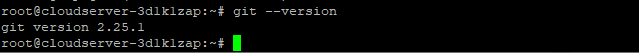

## Introduction

This article will explain how to install Git on Ubuntu 20.04. [Git](https://en.wikipedia.org/wiki/Git) is free and open source software for distributed version control: tracking changes in any set of files, usually used for coordinating work among programmers collaboratively developing source code during software development

Git is a piece of software that allows for the tracking of changes in any set of files, and it is typically used for the purpose of coordinating the work of multiple programmers who are working together on the development of source code for software. Git is both free and open source software. Speed, data integrity, and support for distributed, non-linear workflows (thousands of parallel branches operating on various systems) are some of its goals.

## Installing Git with Apt

```
# sudo apt update
```

```
# sudo apt install git
```

Execute the following command, which will print the version of Git, to ensure proper installation:

```
# git --version
```



Now that you've installed Git on Ubuntu, you can begin using it.

## Configuring Git

Setting up your git username and email address is one of the first steps after installing Git. Each commit you make in Git is linked to your personal information.

Use the following commands to establish your global commit name and email address:

```
# git config --global user.name "Your Name"
```

```
# git config --global user.email "youremail@microhost.com"
```

Typing will check the settings modifications you made:

```
# git config --list
```


The configuration settings are stored in the ~/.gitconfig file:

```
# vi ~/.gitconfig
```


The result should look this:


Either use the git config command (preferred) or manually edit the /.gitconfig file to make additional adjustments to your Git configuration.

If you are Looking to [Install Streamlit on Ubuntu 20.04](https://utho.com/docs/tutorial/how-to-install-streamlit-on-ubuntu-20-04/) I have already posted an article.

Thanks for reading this article on how to install Git on Ubuntu 20.04. I hope it helped. 🙂
