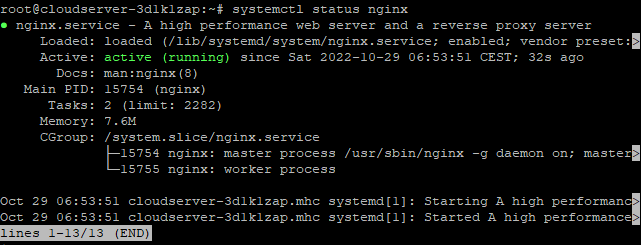
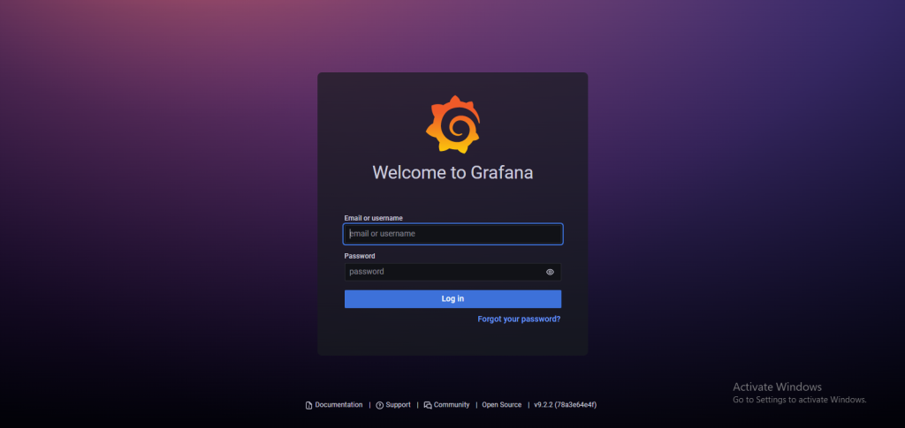

## Introduction

In this article, you will learn how to install Grafana on ubuntu 20.04.

[Grafana](https://en.wikipedia.org/wiki/Grafana) is a free monitoring and data visualisation application that works across multiple platforms. It provides insightful analytics by rendering your data in graphical form and is cross-platform. It is possible to create dynamic dashboards that can be reused, to explore metrics by means of ad hoc queries, to set up alert rules for critical metrics that are constantly evaluated and notify relevant parties of any changes, and to collaborate with members of the team by means of in-built sharing. These are just some of the many features that this software possesses. In addition to that, it enables access to other systems like Graphite, Prometheus, Elasticsearch, and InfluxDB. This guide will walk you through the process of installing Grafana on a server that is running Ubuntu 18.04 or 20.04.

## 1\. Install Grafana

The system packages are required to be updated.

```
# apt update
```

Install the necessary packages for the system.

```
# apt-get install -y gnupg2 curl software-properties-common
```

Add Grafana GPG key.

```
# curl https://packages.grafana.com/gpg.key | sudo apt-key add -
```

Install the Grafana repository on your machine.

```
# add-apt-repository "deb https://packages.grafana.com/oss/deb stable main"
```

Update the system's packages up to date.

```
# apt update
```

Install Grafana

```
# apt -y install grafana
```

Start Grafana service.

```
# systemctl start grafana-server
```

Enable the Grafana service to start automatically when the system boots up.

```
# systemctl enable grafana-server
```

Check the service status.

```
# systemctl status grafana-server
```


The default port for Grafana is 3000, which means you can access it there. It is possible to utilise a reverse proxy to reroute all traffic from port 3000 to port 80, which is the location where Grafana is hosted. Continue reading to find out what to do. The Grafana web interface can be accessed through port 3000 in any other circumstance.

## 2\. Install and Configure Nginx Reverse Proxy (optional)

Install Nginx.

```
# apt install nginx -y
```

Start Nginx service.

```
# systemctl start nginx
```

Allow the Nginx service to launch automatically.

```
# systemctl enable nginx
```

Check the current status of the Nginx service.

```
# systemctl status nginx
```



Unlink the file that is used as the default configuration.

```
# unlink /etc/nginx/sites-enabled/default
```

Create a new configuration file.

```
# vi /etc/nginx/sites-available/grafana.conf
```

In the new file, insert the [code](https://utho.com/docs/tutorial/how-to-install-gradle-on-ubuntu-20-04/) shown below, then save the changes and close the file by escape :wq

```
server {

    listen 80;

    location / {

        proxy_pass http://localhost:3000;

    }

}
```

Link and activate the new configuration file.

```
# ln -s /etc/nginx/sites-available/grafana.conf /etc/nginx/sites-enabled/grafana.conf
```

Test the configuration file.

```
# service nginx configtest
```

Restart Nginx service.

```
# systemctl restart nginx
```

## 3\. Access Grafana Dashboard

Simply open your web browser, navigate to http://Server IP:3000/, and you will have access to the Grafana Web Interface without having to use a reverse proxy. Take, for instance:

```
# http://192.0.2.10:3000
```



## Conclusion

You have Grafana installed on your server successfully. A screen prompting you to log in will appear. Please use admin as both your username and your password. Now that you have access, you can go ahead and configure the Dashboard so that you can start controlling and analysing your data.

Hopefully, you have learned how to install Grafana on ubuntu 20.04.

Thank You 🙂
