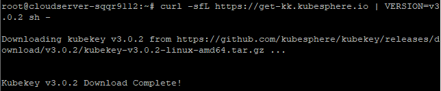
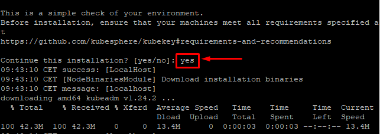
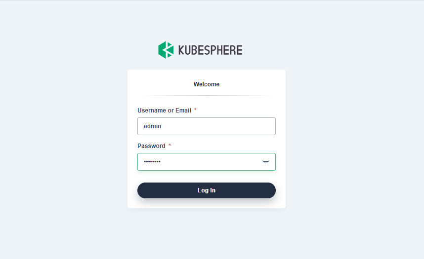
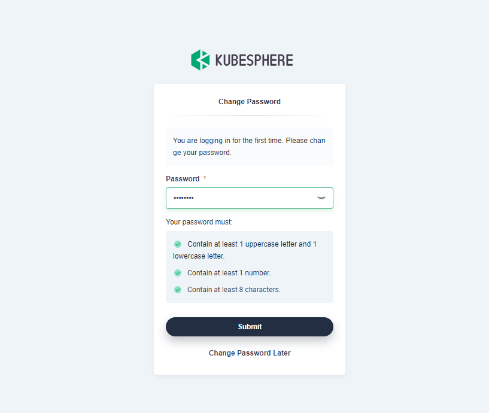
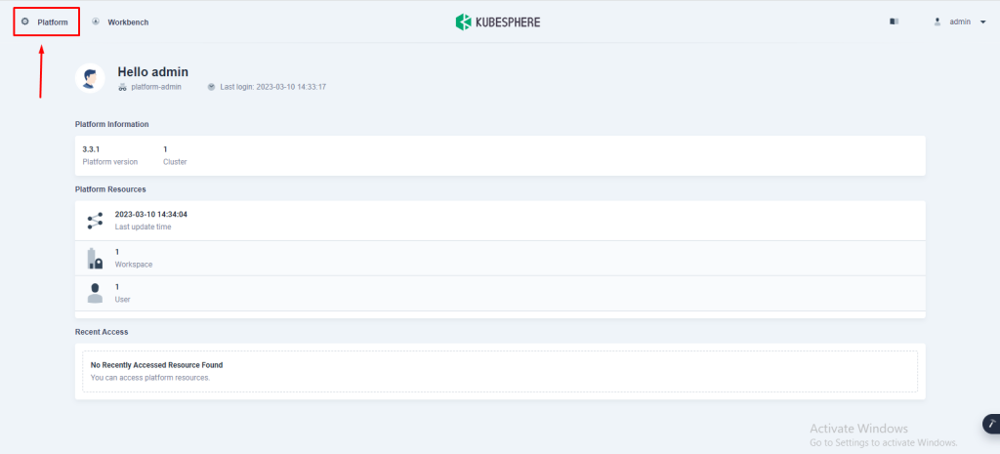
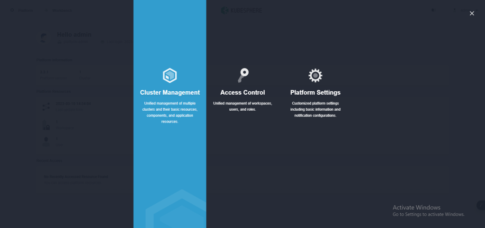
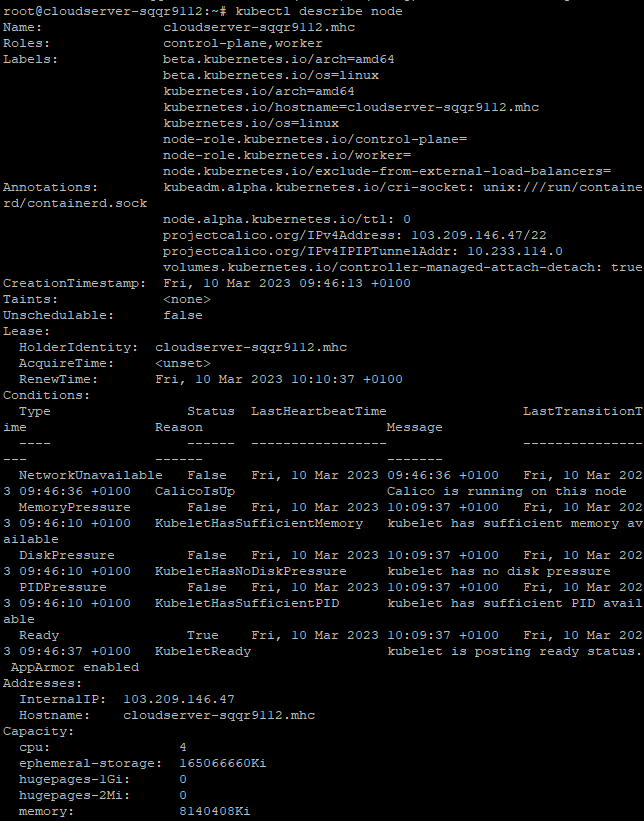

## Introduction

In this article, you will learn how to Install KubeSphere on Ubuntu 22.04.

KubeSphere is an open-source enterprise-grade Kubernetes container platform that streamlines DevOps operations and automates the whole stack of software development. It provides developers with an easy-to-navigate and welcoming online interface that makes it possible for them to construct and monitor feature-rich platforms for enterprise Kubernetes environments.

## Step 1: Preparing your Linux System

The first thing you need to do is select the operating system that will be used to install Kubesphere. The following computer operating systems are the only ones that are currently being supported at the time when this article was written.

- Ubuntu 16.04, 18.04, 20.04, 22.04
- Debian 9, 10
- Red Hat Enterprise Linux 7
- SUSE Linux Enterprise Server 15
- OpenSUSE Leap 15.2

Make sure that the following minimum system requirements are met by the system you choose, regardless of the system you choose:

2 vCPU /4096 MB Memory / 80 GB SSD Disk

NOTE: To prevent future issues, it is highly recommended that you use an operating system that has no other software installed on it.

## Step 2: Installing the necessary pre-requisite packages

Before proceeding with the installation, there are a few prerequisite packages that must be installed. Therefore, set them up in the manner shown.

```
# apt update

```

```
# apt install curl socat conntrack ebtables ipset -y

```

## Step 3: Download the KubeKey now

The next step is to download KubeKey from its release page on Github, or to run the following command:

```
# curl -sfL https://get-kk.kubesphere.io | VERSION=v3.0.2 sh -

```



After that, use the chmod command to make the kk file executable.

```
# chmod +x kk

```

## Step 4: Start the task of installing Kubesphere

Due to the fact that this installation is an all-in-one package, you will not be required to make any adjustments or configurations to your system.

```
# sudo ./kk create cluster --with-kubernetes v1.24.2 --with-kubesphere v3.3.1 --container-manager containerd

```

NOTE: In this stage, if you don't add the –with-kubesphere flag to the command, KubeSphere won't be set up. Only Kubernetes will be set up via KubeKey. If you use the same flag without saying which version of KubeSphere to install, the most recent version will be used. Also, you must pass the –container-manager flag if you want to install Kubernetes 1.24.x.

Once the command is performed, a pre-check is done on your node to make sure that the necessary packages are installed. If everything is in order, you should see the screenshot below.


To continue the process of installation, type "yes" and press the Enter key.



The installation takes a long time—about 20 minutes in our instance. You can now take a break while Kubernetes and Kubesphere are being installed.

When it's done, you'll get some information about how to use the Kubesphere online interface.


Go to the URL given to obtain to the web console on your browser. This will take you to the page below where you can log in. Use the default username and password provided in the previous screenshot to sign in.



Then you'll have to update your password to something different and stronger.



You are eventually directed to the dashboard shown below.


Click on "Platform" in the top left corner to see how your cluster's resources are being used.



When the menu comes up, choose "Cluster Management" from the list.



This brings up the UI that shows how the cluster's resources are being used.


On the left, there is a menu with a range of options for getting to and seeing different parts of your cluster. For example, go to Nodes > Cluster nodes to see the nodes in the cluster.

You will only see one node, which is obvious as you just installed Kubernetes and Kubesphere on one node.


Click "System Components" to see the system features.


Back at the machine, perform the following commands to interact with cluster. (or kubectl commands)

```
# mkdir -p $HOME/.kube

```

```
# sudo cp -i /etc/kubernetes/admin.conf $HOME/.kube/config

```

```
# sudo chown $(id -u):$(id -g) $HOME/.kube/config

```

Run the following command to find out about a node:

```
# kubectl describe node

```



Run the following command to find out about all the pods in all the namespaces on your cluster:

```
# kubectl get pods --all-namespaces

```


## Conclusion

Hopefully, now you have learned how to Install KubeSphere on Ubuntu 22.04.

Check out the [Kubesphere webpage](https://kubesphere.io/) to learn more.

Also Read: [How to Install NGINX Web Server on Ubuntu 22.04 LTS](https://utho.com/docs/tutorial/how-to-install-nginx-web-server-on-ubuntu-22-04-lts/)

Thank You 🙂
