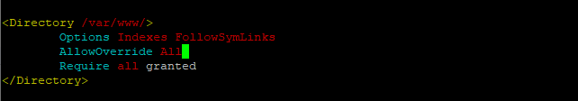
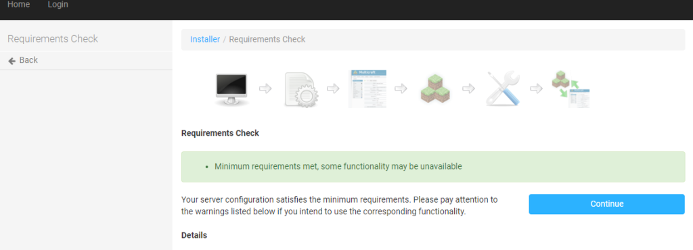
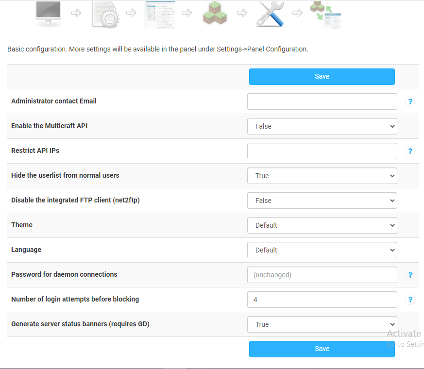

## Introduction

In this article, you will learn how to install Multicraft on ubuntu 20.04.

Multicraft is a powerful admin tool for running many Minecraft servers from the same computer. The purpose of this article is to provide instructions for installing Multicraft on an [Ubuntu 20.04](https://utho.com/docs/tutorial/how-to-setup-sftp-user-accounts-on-ubuntu-20-04/) server. So start with update.

```
# apt-get update
```

## 1\. Install the Dependencies

Install Apache2 and SQLite.

```
# apt-get install apache2 sqlite -y
```

Install PHP and the required PHP extensions.

```
# apt-get install php7.4 php7.4-sqlite php7.4-gd -y
```

Install Java.

```
# apt-get install openjdk-8-jdk -y
```

Edit the Apache configuration file `/etc/apache2/apache2.conf` in your text editor.

```
# vi /etc/apache2/apache2.conf
```

Apache's Directory /var/www/> step needs the AllowOverride option to be set to all.



Save and exit the file, by using escape :wq

Reload the Apache configuration.

```
# service apache2 reload
```

## 2\. Install Multicraft

Download the Multicraft installer.

```
# wget -O multicraft.tar.gz http://www.multicraft.org/download/index?arch=linux64
```

Extract the installer.

```
# tar -xzf multicraft.tar.gz
```

Navigate to the extracted directory.

```
# cd multicraft/
```

Run the installation script.

```
# ./setup.sh
```

During installation, the script will prompt you to answer a series of questions to customise the process. Press ENTER to accept the system's suggested responses if you're at a loss for what to type. If prompted to enable the in-built [FTP](https://en.wikipedia.org/wiki/File_Transfer_Protocol) server, you should say no.

## 3\. Configure the Control Panel

In a web browser, go to the server's IP address and then the subdirectory /multicraft/install.php.


Press **Start Installation**.

If you've completed the steps above without an error, the page shows your server meets the requirements. Click **Continue**.

Multicraft asks you for a confirmation to copy the configuration file. Press **Continue**.



Click **Initialize Database**. Multicraft has initialized the database for use. Press **Continue** once again.

Click **Login** in the black navigation bar at the top of the page.


A sign in form shows up on your screen. Input the name microhost and password microhost. Click **Login**.

Press **Continue** again.

Click **Initialize Database** again and then **Continue**.

Fill in your email address into the **Administrator contact Email** field.



Click the **Save** button.

Start the Multicraft daemon.

```
# /home/minecraft/multicraft/bin/multicraft -v start
```

To resume browsing, simply reopen your current browser. To continue, please refresh the page. Select Multicraft and hit the Next button.


For safety reasons, you should remove the Multicraft setup file.

```
# rm /var/www/html/multicraft/install.php
```

## 4\. Change the Administrator Account Password

To keep your Multicraft control panel safe from hackers, you should update the password for the administrator account.

1\. Choose Users from the top menu.

2\. In the Users menu, click on My Profile.

3\. To change your current password, click the Change button and enter admin.

4\. Fill out the New Password and Confirm Password sections with a new password.

5\. Press **Save**.

## Conclusion

Following reading this article, you should now be able to successfully set up Multicraft.

Thank You 🙂
