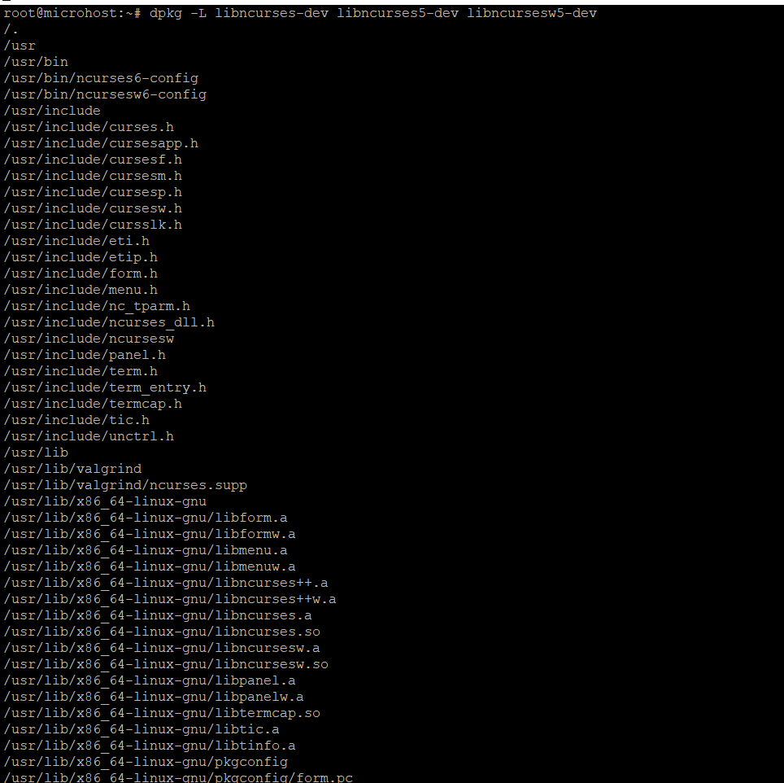
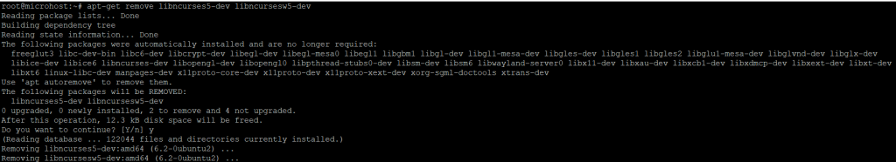

**Description**

In this article, we will acquire new knowledge how to Install [Ncurses](https://en.wikipedia.org/wiki/Ubuntu) Library on Ubuntu 20.04. Ncurses, also known as the new curses library, is an emulation of curses that can be run on System V Release 4.0 (SVr4) as well as a great number of other systems. Ncurses is a free and open-source piece of software. It makes use of the terminfo format, supports pads and colour and multiple highlights, forms characters, and function-key mapping, and it possesses all of the additional advancements that SVr4-curses offers over BSD curses. The SVr4 curses served as the foundation for the X/Open curses. In this section, we will go over the procedures required to install [Ncurses](https://utho.com/docs/tutorial/how-to-install-the-opengl-library-on-ubuntu-20-04/) on computers running Ubuntu 20.04 LTS.Now we will follow the steps given below to how to Install Ncurses Library on Ubuntu 20.04

## Step 1: Update Your Server

Ncurses library package on your system, it's always a good idea to sync your system with the latest available changes on the default Ubuntu repo by using the commands sudo apt update && sudo apt upgrade, as shown below.

```
apt update && sudo apt upgrade
```


## Step 2: Install Package Ncurses Library

Use the command apt-get install libncurses5-dev libncursesw5-dev to install the Ncurses library. This will get the package and all of its dependencies from the usual Ubuntu repository and install them.

```
apt-get install libncurses5-dev libncursesw5-dev
```


## Step 3: Verify Package

You will be able to confirm that the correct library package was installed by using the dpkg -L libncurses-dev, libncurses5-dev, and libncursesw5-dev commands, as demonstrated in the following example.

```
dpkg -L libncurses-dev libncurses5-dev libncursesw5-dev
```


## Step 4: Uninstall Package Ncurses Library

You have the option to remove it from your system by using the command sudo apt-get delete libncurses5-dev libncursesw5-dev, which is demonstrated in the following paragraph.

**Important**:- Be careful when using the below command, since it has the potential to delete any of the dependant packages that are needed by other applications that are now running on the system.

```
apt-get remove libncurses5-dev libncursesw5-dev
```


I hope you found this post helpful How to Install Ncurses Library on Ubuntu 20.04 to read more knowledge base articles, go to the microhost website.

Must Read:- [https://utho.com/docs/tutorial/how-to-install-the-opengl-library-on-ubuntu-20-04/](https://utho.com/docs/tutorial/how-to-install-the-opengl-library-on-ubuntu-20-04/)

**ThankYou**
