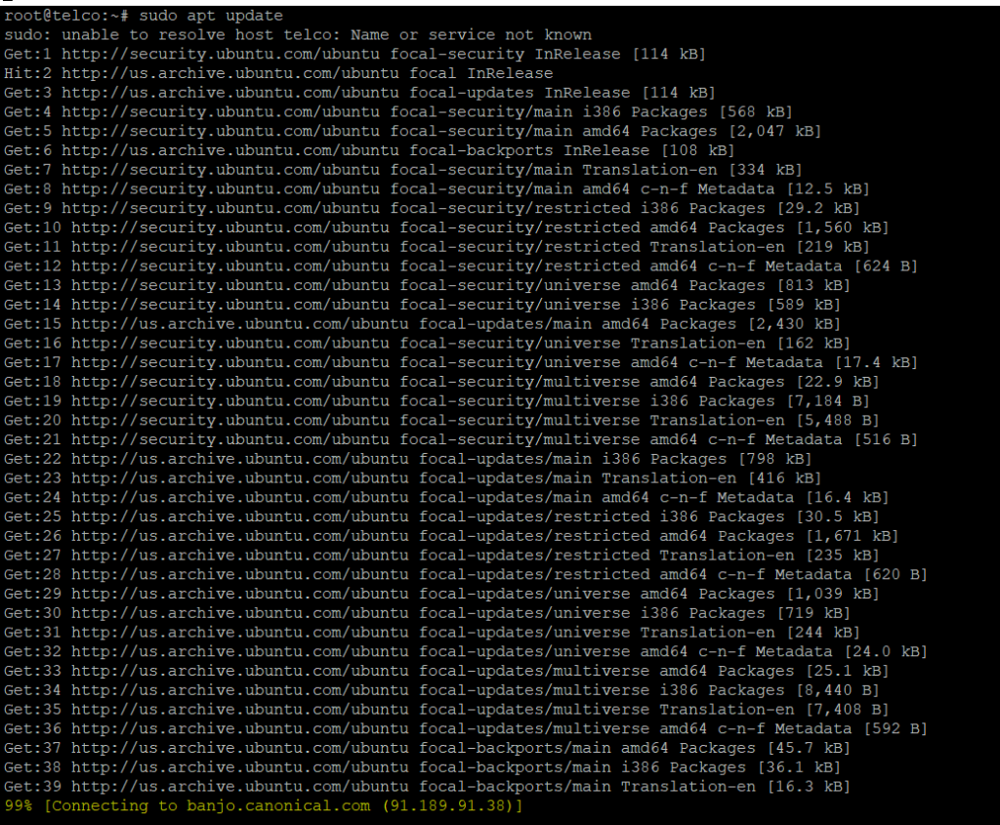
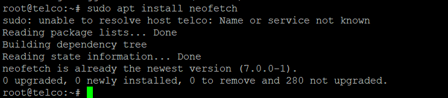
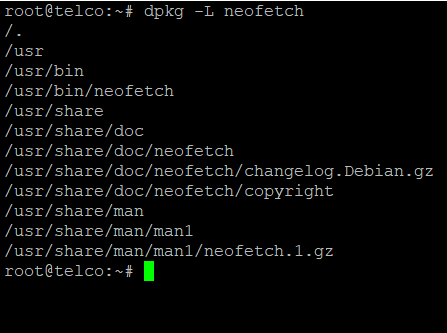
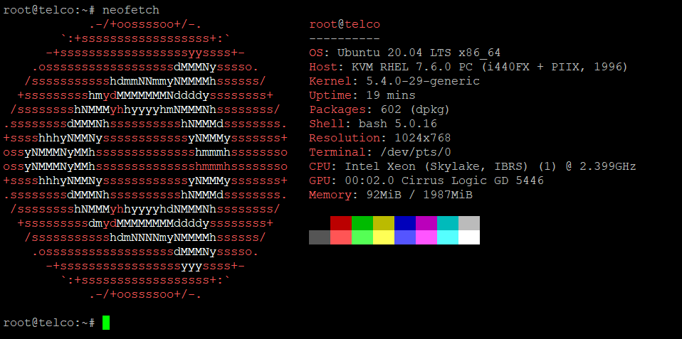

<figure>


<figcaption>

How to Install Neofetch on Ubuntu 20.04 LTS

</figcaption>

</figure>

**Description**

In this article, we will learn how to install [Neofetch](https://utho.com/docs/tutorial/how-do-i-find-my-apache-version-in-plesk/) on Ubuntu 20.04 LTS. Neofetch is a free command-line tool written in Bash 3.2+ that is open source. to make it easy for you to see information about your operating system, software, and hardware. Neofetch lets you set up and show information about the operating system the way you want. You can set up your computer to use an image, your wallpaper, a custom ASCII file, or nothing at all. Neofetch works on more than 150 operating systems, including Windows, Linux, and Mac OS X. It's also easy to set up on almost every operating system. Here are the steps to install Neofetch on systems running Ubuntu 20.04 LTS.

Follow the below steps to learn How to Install [Neofetch](https://en.wikipedia.org/wiki/Neofetch) on Ubuntu 20.04 LTS

## Step 1: Update Server

You must install all available updates from the default Ubuntu repository using the command sudo apt update and upgrade all packages to the most recent version.

```
sudo apt update
```


## Step 2: Install Neofetch package

You can use the sudo apt install neofetch command to install neofetch from the default Ubuntu repository, as shown below. This will download and install the package, as well as any dependencies it may have.

```
sudo apt install neofetch
```


## Step 3: Check Installation

After the installation is done, you can use the dpkg -L newfetch command, as shown below, to check the installed file path.

```
dpkg -L neofetch
```


## Step 4: Version

With the neofetch —version command, as demonstrated below, you can also determine the current installed version.

```
neofetch --version
```


## Step 5: Launch Neofetch

To utilise the neofetch utility, start a command-line terminal and type neofetch to obtain all system-related information.

```
neofetch
```


I sincerely hope that each and every one of these things was clear to you. How to Install Neofetch on Ubuntu 20.04 LTS

Must read :- [https://utho.com/docs/tutorial/find-multiple-ways-to-user-account-info-and-login-details-in-linux/](https://utho.com/docs/tutorial/find-multiple-ways-to-user-account-info-and-login-details-in-linux/)
