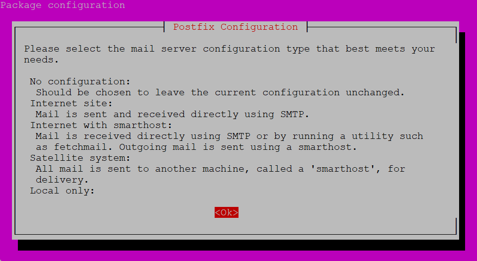
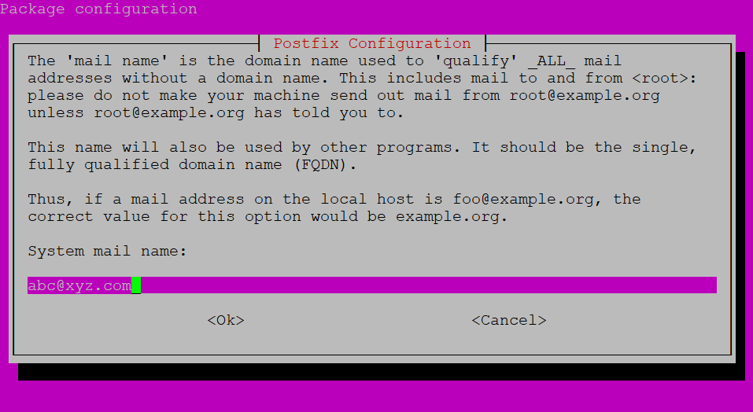
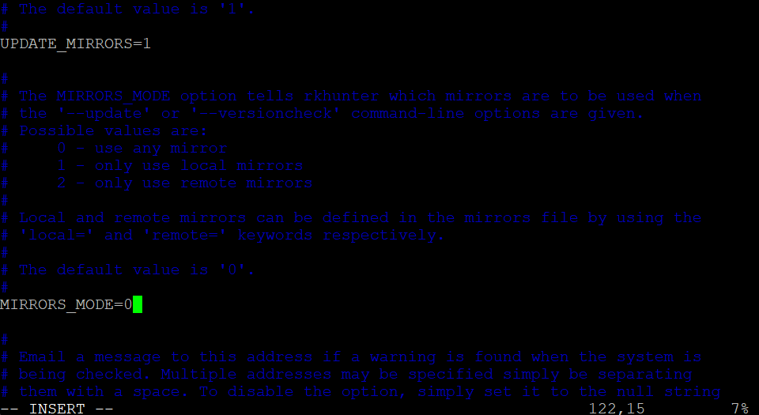
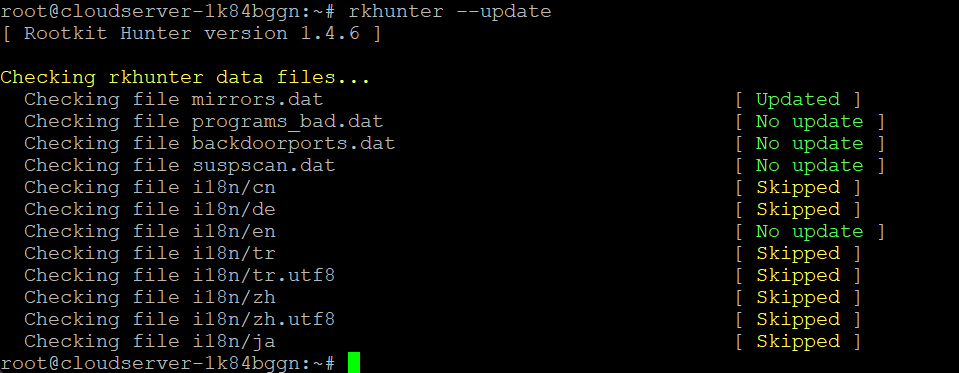
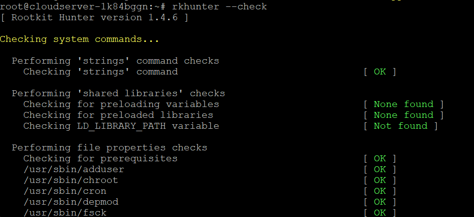

## Introduction

In this article, you will learn how to install Rkhunter on Ubuntu 22.04.

[Rkhunter](https://en.wikipedia.org/wiki/Rkhunter), which is also known as Rootkit Hunter, is responsible for searching the system for rootkits. It is an open-source programme that has been developed specifically for Linux and operating systems that are based on Linux.

You can use the tool to safeguard your system from being attacked by third parties, maintain your privacy, and enhance its overall security. This programme investigates hidden files, potentially malicious strings, and incorrect permissions in binary files.

Rkhunter does a system scan to determine which rootkits are present by comparing the SHA-1 hashes found in local folders with those found in an online database. Because it is developed in Bash, which offers more portability, this programme is compatible with all UNIX-based operating systems.

## Installation of Rkhunter

**The first step is to bring the system up quick with the latest data.**

```
# apt update

```

**Now, type this command to install Rkhunter from Ubuntu's official repository:**

```
# apt install rkhunter

```

**The system moves you to the window for configuring packages. Click the "Tab" key. Then, click "OK" and press "Enter" to go to the next page.**



**Here, choose the type of mail configuration:** **Select Local only then press ok.**


**Last, type the name of the email. The process for downloading is done when you press the "Enter" button:**



## Rkhunter's configuration

**After you have installed Rkhunter, it is time to set it up. To open the config file, type the following command:**

```
# vi /etc/rkhunter.conf

```

**Scroll down to the part named UPDATE\_MIRRORS and change the value from 0 to 1. Change the MIRRORS\_MODE to 0 as well:**



**Scroll down until you see WEB\_CMD after making the changes above. To make it Null, remove away /bin/false:**


**Save the file to make sure the changes are done correctly.**

**You can also use the following tools to check for any unexpected configurations:**

```
# rkhunter -C

```

**If the command's result is 1, it means that there is an issue with how the operating system is set up.**

**In the end, run the following command to check for rootkits and other threats by updating the Rkhunter database:**

```
# rkhunter --update

```



**After setting up Rkhunter, you can now run the following command to start the Rkhunter scan:**

```
# rkhunter --check

```



**If Rkhunter finds issues with security, it will tell you how to fix them.**

## Conclusion

Hopefully, you have learned how to install Rkhunter on Ubuntu 22.04.

**Also Read:** [How to Install NGINX Web Server on Ubuntu 22.04 LTS](https://utho.com/docs/tutorial/how-to-install-nginx-web-server-on-ubuntu-22-04-lts/)

Thank You 🙂
