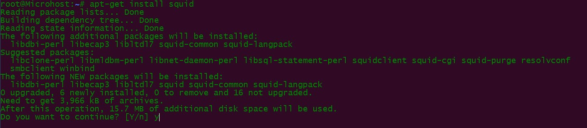
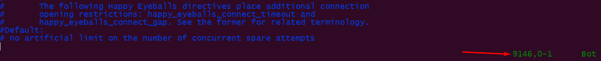
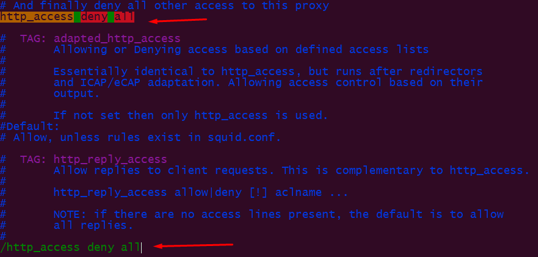
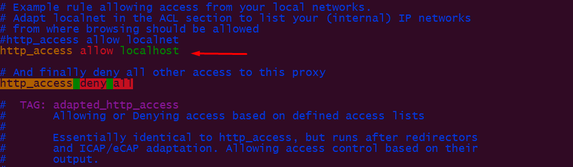
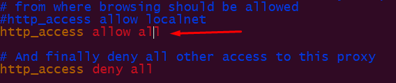

<figure>


<figcaption>

How to install squid proxy on Ubuntu server

</figcaption>

</figure>

## Description

In this tutorial, we will learn how to install Squid proxy on Ubuntu server. A proxy server is a computer system or router that lets users connect to the internet. So, it makes it harder for hackers to get into a [private network](https://en.wikipedia.org/wiki/Private_network). It's a server.

Every computer that is connected to the network has an [IP (Internet Protocol) address](https://utho.com/docs/tutorial/how-to-set-manual-or-static-ip-address-on-ubuntu-server/) that identifies it as a unique device. In the same way, the proxy server is a network computer with its own IP address. But sometimes we want to get into restricted websites or servers, but we don't want to show who we are (IP address). When this happens, the proxy server comes into play. The same thing can be done with the proxy server. It has different levels of functionality, security, and privacy depending on how it is used, what the company needs, or what its policies are. In this section, we'll talk about what a proxy server is, its types, benefits, why you need one, and how it works.

You can make web requests from a different IP address than your own by using a proxy server. You can also use a proxy server to find out how the web is served in different places or to avoid being watched or having your web traffic slowed down.

Squid is a well-known, stable, and open-source HTTP proxy. In this tutorial, you'll learn how to install and set up Squid on an Ubuntu 20.04 server so that it can act as an HTTP proxy.

## Prerequisites:

1. Super User( root user) or any normal user with SUDO priviliges.
2. apt-get package installer
3. A text editor, such as vi/ vim or nano

## Install squid proxy

**Step 1: First let's update the package list of apt**

```
# apt update 
```

**Step 2: Install the squid daemon**

```
# apt install squid 
```

<figure>



<figcaption>

Installation of squid

</figcaption>

</figure>

## **Configuring the Squid Proxy Server** **to allow to connect any device**

By default, Squid doesn't let any clients outside of this server connect to it. You'll need to make some changes to its configuration file, which is located at /etc/squid/squid.conf, in order to make that work.

```
# vi /etc/squid/squid.conf 
```

<figure>



<figcaption>

length of config file

</figcaption>

</figure>

Squid configuration file may have more than 9000 numbers of lines and also contains large amount of options. But most of them are already commented and therefore not in use.

To find the port on which squid works, find the keyword- http\_port in configuration file. In vi or vim, you can search the file by pressing forward slash( / ) and then the keyword.

<figure>


<figcaption>

http\_port keyword

</figcaption>

</figure>

Now search for the 'http\_access deny all' keyword to allow or check which IP pool or Ips are allowed to connect to the squid.

<figure>



<figcaption>

check allowed ip

</figcaption>

</figure>

Now slightly above the keyword- http\_access deny all, you will find another keyword- 'http\_access allow localhost'. This keyword is used only to connect the squid server by localhost.

<figure>



<figcaption>

keywork to connect only by localhost

</figcaption>

</figure>

Here you can specify either allow to all or to any particular ip or the range of ip pool.

<figure>



<figcaption>

allow a specific ip

</figcaption>

</figure>

You can also create the rules just we do in making rules of access control list. You just need to create a rule and place them accordingly.

<figure>


<figcaption>

Rule for ACL

</figcaption>

</figure>

Now after making all the changes, please do not forget to restart the squid server's service.

```
# systemctl restart squid 
```

> Congratulations!!! Your Squid Proxy Server successfully installed.
> 
> Thank You
