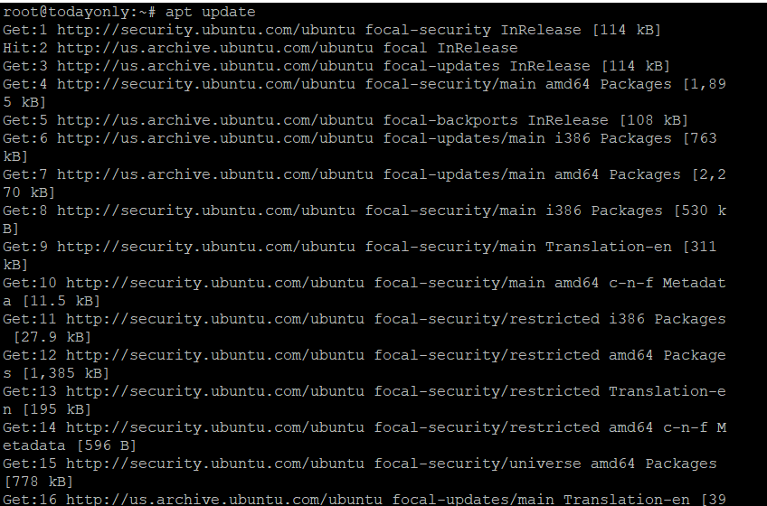
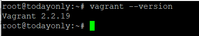
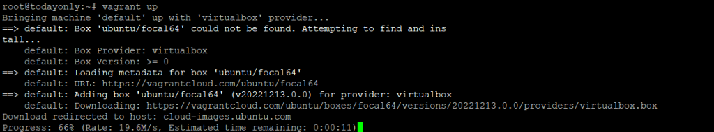

**Description**

Install Vagrant on Ubuntu 20.04 LTS. [Ruby](https://en.wikipedia.org/wiki/Ruby_(programming_language)) is the programming language used in the development of the open-source software known as Vagrant. Because of how easily it integrates with a variety of virtual environment providers including VirtualBox, VMware, and Docker, it has gained a significant amount of popularity as a method for rapidly constructing virtual environments. It helps to streamline the process and lessen the amount of labour required to run and operate virtual machines (VMs) on your systems. Vagrant makes it possible to do difficult tasks by providing a straightforward set of commands.

## What exactly is a Provider

In the Vagrant Ecosystem, a provider is a software virtualization solution such as VirtualBox, VMware Fusion, or VMware Workstation. 

## What is a Vagrantfile

A Vagrantfile is a configuration file that is written in Ruby syntax. Vagrant uses this file to figure out what to do when the user sends a command from the terminal.

## Update Server

It is strongly advised that before going through the steps to install Vagrant, you check for any updates from all of the configured repositories by using the apt update or apt-get update command, as shown below. This is done before going through the steps to install Vagrant. This will also update the package cache with any information on packages that is currently available in any of the preset repositories.

```
apt update
```


## Install Provider

To make VMs, Vagrant needs a provider. Vagrant's default provider is VirtualBox, so to install it, run the command apt install virtualbox, as shown below.

```
apt install virtualbox
```


## Download Vagrant

You can use any file transfer tool, like wget or curl, to get the latest version of Vagrant from the official website. Here, we're using the wget command to download the latest Vagrant Debian package, version 2.2.19. It will download the package to the working directory.

```
wget https://releases.hashicorp.com/vagrant/2.2.19/vagrant_2.2.19_x86_64.deb
```


## Install Vagrant

You can now install this package using the apt package manager. To start the installation, you must run the command apt install./vagrant 2.2.19 x86 64.deb.

```
apt install ./vagrant_2.2.19_x86_64.deb
```


## Check Version

```
vagrant --version
```


## Setup the Vagrantfile

Vagrant can be used to make a VM. Before you can do that, you need to set up the Vagrantfile with the settings for the VM you want to start. For example, here we're going to make an Ubuntu VM, so we need to first set up the environment by running the vagrant init ubuntu/focal64 command.

```
vagrant init ubuntu/focal64
```


## Configure VM

Once Vagrantfile is made, you can run the vagrant up command to use Vagrantfile to create and set up a VM. This is the most important command because it is the only one that makes Vagrant virtual machines (VMs). Read the documentation to learn more.

```
vagrant up
```


## Connect VM

You need to use the vagrant ssh command, as shown below, to connect to the default VM. If there are multiple nodes running, you can connect to a specific one with the vagrant ssh node name> command. Vagrant ssh documentation: more info

```
vagrant ssh
```
Vagrant on Ubuntu 20.04 LTS. Vagrant, a piece of open-source software, was made using the programming language Ruby. Because it works well with VirtualBox, VMware, and Docker, among others, it has become very popular as a way to quickly build virtual environments. It makes the process of running and operating virtual machines (VMs) on your systems easier and less time-consuming. Vagrant makes it easy to do hard things by giving you a simple set of commands.

**Must Read**: [For Application Data Storage on Fedora 14, Use MongoDB](https://utho.com/docs/tutorial/for-application-data-storage-on-fedora-14-use-mongodb/)

**Thankyou**
