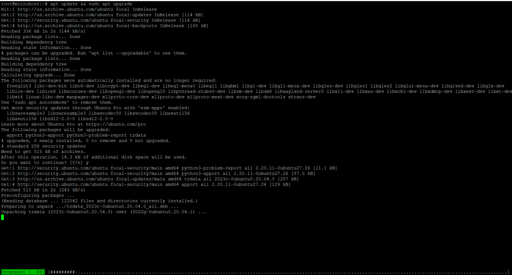
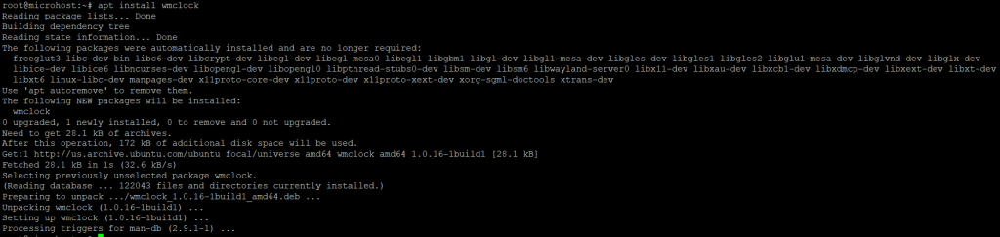

**Description**

In this article, we will acquire new knowledge how to Install [wmclock](https://en.wikipedia.org/wiki/Ubuntu) on Ubuntu 20.04. The free and open-source wmclock is a dockable clock for the Window Maker window manager. It is essentially an applet created by Alfredo Kojima to display the date and time in a dockable component similar to the NextStep(tm) operating system's clock. It is also quite simple to install on the majority of popular [Linux](https://utho.com/docs/tutorial/how-to-install-ncurses-library-on-ubuntu-20-04/) distributions. Here are the instructions for installing wmclock on Ubuntu 20.04.

Please proceed by following the steps below. How to Install wmclock on Ubuntu 20.04..

## Step 1: Update Your Server

First, using the sudo apt update and sudo apt upgrade commands, bring all of the installed packages up to speed with the most recent version available in the Ubuntu repository. This will get you started.

```
apt update && sudo apt upgrade
```
<figure>



<figcaption>

How to Install wmclock on Ubuntu 20.04

</figcaption>

</figure>

## Step 2: Install wmclock package

Using the command apt install wmclock, which is given below, you may download and install wmclock from the default repository that comes with Ubuntu. The program, as well as all of its dependencies, will be downloaded and installed as a result of this action.

```
apt install wmclock
```


## Step 3: Verify Installed package

After a successful installation, use the dpkg -L wmclock command to verify the installed files path, as shown below.

```
dpkg -L wmclock
```


## Step 4: Show Version

Use the wmclock --version command, as shown below, to determine the current installed version of wmclock.

```
wmclock --version
```


## Step 5: Uninstall wmclock

When you're finished with wmclock, you can remove it from your system by running the sudo apt remove wmclock command, as shown below.

```
apt remove wmclock
```


I really hope that you have a complete understanding of all the processes to How to Install wmclock on Ubuntu 20.04

Must Read :- [https://utho.com/docs/tutorial/how-to-install-ncurses-library-on-ubuntu-20-04/](https://utho.com/docs/tutorial/how-to-install-ncurses-library-on-ubuntu-20-04/)

**Thank You**
